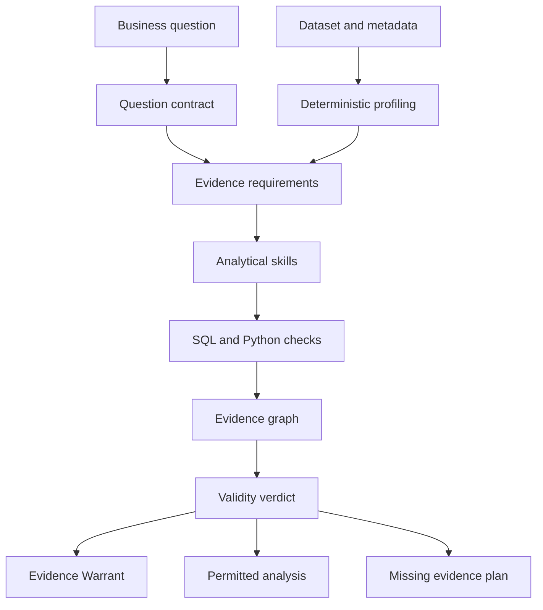
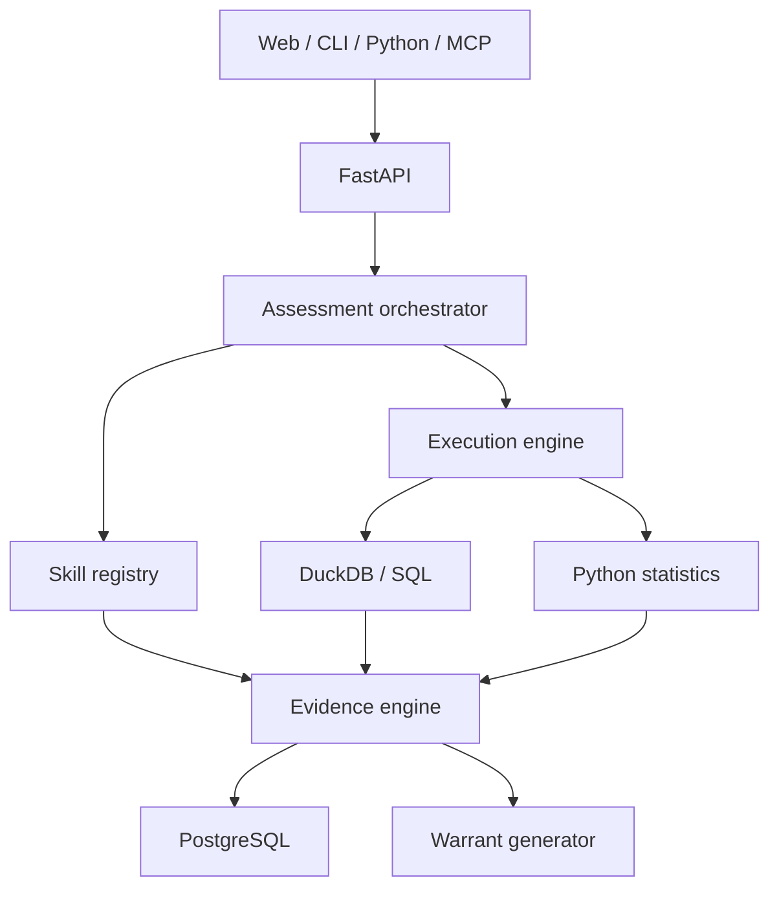

<div align="center">

# Answerable

### Before you trust the answer, verify that the data can support it.

**An open-source analytical validity engine for determining what your data can — and cannot — justify.**

[Why Answerable](#why-answerable) · [How it works](#how-it-works) · [Evidence Warrant](#the-evidence-warrant) · [Roadmap](#roadmap)

</div>

> [!IMPORTANT]
> Answerable is in the design and early development stage. The interfaces shown below define the intended product contract and may change before the first release.

## The problem

Modern analytics tools are very good at producing answers.

They can generate SQL, clean tables, build charts, fit models, and write persuasive summaries. But a technically correct calculation can still support the wrong conclusion.

A dataset may be:

- good enough to describe monthly revenue;
- incomplete for estimating margin;
- biased for measuring retention;
- fundamentally unable to establish whether a campaign caused an observed change.

**Data quality is not a property of a dataset alone. It is a relationship between the data, the question, the analytical design, and the claim being made.**

Answerable evaluates that relationship before a result is trusted.

## Why Answerable

Ask:

> Did the pricing change improve 90-day retention?

A conventional AI analyst may return a chart and report a +6.2 percentage-point increase.

Answerable is designed to return something more defensible:

```text
VERDICT
PARTIALLY ANSWERABLE

YOU MAY CLAIM
Observed 90-day retention was 6.2 percentage points higher after
the pricing change.

YOU MAY NOT CLAIM
The pricing change caused the increase.

WHY
- No comparable control group exists.
- Customer composition changed between periods.
- 18% of post-change cohorts have not reached 90 days.
- Exposure to the new price is not recorded at customer level.

MINIMUM EVIDENCE NEEDED
- Customer-level price exposure.
- A fully matured post-change cohort.
- A credible comparison group or validated causal design.
```

Answerable does not ask only, “Can this query run?”

It asks:

> **Can this evidence support this conclusion?**

## What Answerable is

Answerable is intended to be:

- an **analytical preflight check** before an analysis is executed;
- an **evidence mapper** between a question and the available data;
- a **validity engine** for descriptive, comparative, diagnostic, predictive, and causal questions;
- an **abstention layer** for AI data analysts;
- a generator of inspectable, machine-readable **Evidence Warrants**;
- a reusable CLI, Python library, API, MCP server, and CI gate.

Answerable is **not** intended to be:

- another chat-with-your-CSV application;
- a generic data-quality score;
- an AutoML platform;
- a dashboard generator;
- a SQL copilot;
- an LLM that hides unsupported reasoning behind a confidence score.

## How it works



### 1. Frame the question

Answerable translates an ambiguous business question into an explicit analytical contract:

- decision and intended action;
- population;
- unit of analysis;
- outcome and metric definition;
- treatment or comparison;
- time window;
- required effect size;
- analytical claim type;
- assumptions.

### 2. Inspect the evidence

The execution engine profiles the actual data using deterministic SQL and Python checks:

- schema and semantic types;
- grain and candidate keys;
- nulls and missingness patterns;
- duplicate entities and duplicate events;
- join cardinality and fan-out;
- temporal coverage and cohort maturity;
- outliers and impossible values;
- class balance and sample composition.

### 3. Activate analytical skills

The orchestrator selects only the capabilities required by the question:

| Skill | Responsibility |
| --- | --- |
| Question framing | Converts business language into a testable analytical contract |
| Schema understanding | Infers entities, relationships, keys, grain, and join risks |
| Data quality | Evaluates integrity in relation to the intended claim |
| Metric design | Validates numerators, denominators, windows, cohorts, and aggregation |
| Missing data | Examines MCAR, MAR, MNAR patterns and sensitivity |
| Sampling and selection | Detects representativeness, attrition, and survivorship risks |
| Temporal validity | Checks leakage, seasonality, censoring, and incomplete periods |
| Statistical power | Estimates uncertainty, power, and minimum detectable effects |
| Causal validity | Evaluates treatment, confounding, positivity, and identifiability |
| Predictive validity | Checks leakage, calibration, drift, and generalization |
| Analysis planning | Produces a justified, executable analytical plan |
| Evidence explanation | Separates facts, inferences, assumptions, and recommendations |

### 4. Measure, do not invent

The LLM may interpret the question, propose checks, and explain results. It cannot declare that a check passed.

Calculations are performed by deterministic components such as DuckDB, Polars, SciPy, statsmodels, scikit-learn, and causal-inference libraries. Every material finding must reference an execution artifact.

> **The model reasons. Tools measure. Rules verify. Evidence decides.**

### 5. Build the evidence graph

Each possible claim is connected to:

- required variables;
- analytical assumptions;
- executed checks;
- observed evidence;
- unresolved blockers;
- permitted and forbidden conclusions.

The planned interface will make this relationship inspectable rather than hiding it inside a generated narrative.

## Verdicts

Answerable uses categorical verdicts instead of a misleading universal “data quality” score.

| Verdict | Meaning |
| --- | --- |
| `ANSWERABLE` | The available evidence supports the specified claim within stated uncertainty |
| `ANSWERABLE_WITH_ASSUMPTIONS` | The claim is supported only if explicit assumptions are accepted |
| `PARTIALLY_ANSWERABLE` | A narrower or descriptive version of the question can be answered |
| `NOT_ANSWERABLE_YET` | Required evidence is missing but could still be collected |
| `FUNDAMENTALLY_UNIDENTIFIABLE` | The existing design cannot identify the requested effect |
| `MISLEADING_QUESTION` | The wording, metric, or comparison would encourage a false interpretation |
| `INSUFFICIENT_POWER` | The design is plausible, but the sample cannot detect a relevant effect |
| `DATA_INTEGRITY_FAILURE` | Data defects make the result unstable or irreproducible |

## Question-relative data quality

Answerable treats a defect according to its impact on the question.

| Observation | Generic profiling | Answerable interpretation |
| --- | --- | --- |
| 60% of phone numbers are missing | Severe missingness | Irrelevant to a margin analysis |
| 8% of product costs are missing | Moderate missingness | Critical to a profitability claim |
| Repeated order IDs | Possible duplicates | Could be legitimate line items; grain must be resolved first |
| Historical customers are absent | Coverage limitation | Potentially fatal to a retention analysis |
| Marketing channel is missing for inactive customers | Missing values | Differential missingness that may bias attribution |

The goal is not to produce a cleaner table at any cost. It is to determine whether the evidence remains valid for the intended conclusion.

## The Evidence Warrant

The primary artifact is a structured record of what may and may not be claimed.

```yaml
question: "Did the campaign increase 90-day retention?"
verdict: PARTIALLY_ANSWERABLE

allowed_claim:
  statement: >
    Observed retention was 4.8 percentage points higher after
    the campaign.
  evidence:
    - check://retention/cohort-comparison

forbidden_claim:
  statement: "The campaign caused the increase."
  blockers:
    - no_comparable_control
    - incomplete_exposure_tracking
    - immature_cohorts

assumptions:
  - no_concurrent_pricing_change

minimum_required_evidence:
  - customer_level_campaign_exposure
  - complete_pre_campaign_period
  - matured_90_day_cohorts

recommended_design:
  method: controlled_interrupted_time_series
  sensitivity_checks:
    - placebo_dates
    - pretrend_stability
    - cohort_composition
```

Warrants are planned to be exportable as JSON, YAML, Markdown, HTML, and notebook-ready analysis contracts.

## Planned interfaces

### CLI

```bash
answerable assess customers.parquet \
  --question "Did the campaign increase 90-day retention?"
```

### Python

```python
from answerable import assess

result = assess(
    question="Did the campaign increase 90-day retention?",
    data="customers.parquet",
)

print(result.verdict)
print(result.allowed_claim)
print(result.blockers)
```

### API

```http
POST /v1/assessments
POST /v1/assessments/{assessment_id}/execute
GET  /v1/assessments/{assessment_id}/warrant
```

### Agent and CI integrations

Planned integrations include:

- MCP tools for analytical agents;
- a GitHub Action that rejects unsupported claims;
- Jupyter notebook exports;
- read-only connections to analytical databases;
- machine-readable policies for organizational analytical standards.

## AnswerableBench

A validity engine needs a benchmark that tests whether it knows when **not** to answer.

AnswerableBench is planned as a collection of realistic analytical cases containing:

- a business question;
- one or more datasets;
- hidden validity traps;
- the correct verdict;
- permitted claims;
- forbidden claims;
- expected evidence;
- the minimum viable repair.

Initial scenarios will cover:

- duplicate inflation;
- many-to-many join explosions;
- Simpson's paradox;
- survivorship and selection bias;
- immature cohorts and censoring;
- temporal and target leakage;
- confounding;
- sample-ratio mismatch;
- missing-not-at-random data;
- seasonality and structural breaks;
- underpowered experiments;
- multiple testing;
- denominator drift;
- changing metric definitions;
- regression to the mean.

Target benchmark metrics include verdict accuracy, forbidden-claim detection, evidence-requirement recall, false-blocker rate, calibration, explanation faithfulness, and reproducibility.

## Proposed architecture



Proposed technical foundation:

- Python 3.12;
- FastAPI and Pydantic;
- DuckDB and Polars;
- SciPy and statsmodels;
- scikit-learn;
- optional DoWhy/EconML adapters;
- PostgreSQL for assessment state;
- React and TypeScript;
- Cytoscape.js for the evidence graph.

## Roadmap

### Phase 0 — Specification

- [x] Define the product thesis
- [x] Define the core verdict taxonomy
- [x] Define the Evidence Warrant concept
- [ ] Publish the formal domain model and schemas
- [ ] Define the first AnswerableBench cases

### Phase 1 — Validity core

- [ ] Question Contract schema
- [ ] Dataset profiling
- [ ] CheckPlan execution protocol
- [ ] Evidence graph domain model
- [ ] Rule-based verdict engine
- [ ] JSON and Markdown warrants

### Phase 2 — Analytical skills

- [ ] Grain and join validation
- [ ] Question-relative data quality
- [ ] Metric validation
- [ ] Missing-data analysis
- [ ] Temporal validity
- [ ] Statistical power
- [ ] Causal validity
- [ ] Predictive validity

### Phase 3 — Product experience

- [ ] Interactive evidence graph
- [ ] Guided question framing
- [ ] Claim inspector
- [ ] Missing-evidence collection plan
- [ ] Reproducible analysis export

### Phase 4 — Ecosystem

- [ ] Python package
- [ ] CLI
- [ ] REST API
- [ ] MCP server
- [ ] GitHub Action
- [ ] Database connectors

## Design constraints

The project will follow several non-negotiable rules:

1. No numerical claim without a traceable execution artifact.
2. No silent data repair.
3. No causal language without an identifiable causal design.
4. No “no effect” conclusion from an underpowered analysis.
5. No single opaque quality score.
6. No LLM-generated verdict that overrides deterministic blockers.
7. The same inputs and configuration must produce the same verdict.
8. Every blocker must explain what failed and how it could be repaired.
9. Facts, inferences, assumptions, and recommendations must remain separate.
10. Refusing to answer is a successful analytical outcome.

## Project status

Answerable is currently an early-stage open-source project. The immediate objective is to build a small, rigorous vertical slice:

1. ingest a CSV or Parquet file;
2. frame one retention or campaign-effect question;
3. detect a set of known validity traps;
4. produce an evidence graph;
5. issue a reproducible Evidence Warrant.

The first release will prioritize correctness, inspectability, and benchmark coverage over the number of supported data sources or analytical methods.

## Contributing

The contribution model will be published with the first executable prototype.

The most valuable future contributions will include:

- adversarial analytical cases;
- deterministic validity checks;
- benchmark datasets;
- statistical-method reviews;
- evidence-graph UX;
- integrations that preserve provenance and reproducibility.

If you work in analytics, statistics, causal inference, data quality, or AI evaluation and this problem resonates with you, opening a discussion or issue will be welcome once issue templates are available.

## License

A license has not yet been selected. Until a license file is added, all rights remain reserved by the copyright holder.

---

<div align="center">

**A number can be correct while the conclusion is wrong.**

</div>
