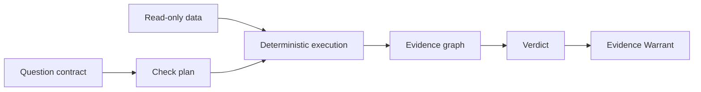

<div align="center">

# Answerable

### Evidence before answers.

**A deterministic analytical-validity engine that decides what your data can—and cannot—justify.**

[Quickstart](#quickstart) · [What ships in v010](#what-ships-in-v010) · [Architecture](#architecture) · [Contributing](CONTRIBUTING.md)

</div>

> [!NOTE]
> **v0.1.0 is a technical preview.** The validity core, schemas, execution safeguards, evidence model, warrants, benchmark gate, Python API and interface contracts are executable. The CLI and web layers are currently thin contract surfaces, not a finished end-user application.

## Why this exists

Analytics software optimizes for producing an answer. Answerable optimizes for knowing whether an answer is defensible.

A calculation can be correct while the conclusion is wrong: a retention lift without mature cohorts, a causal claim without a comparison group, a forecast with target leakage, or a margin metric after a many-to-many join. Answerable records those limits explicitly and fails closed when required evidence is missing.

> **The model may interpret. Tools measure. Rules verify. Evidence decides.**

## What ships in v0.1.0

- versioned domain models and 21 public JSON Schemas;
- deterministic lifecycle, idempotency and SQLite persistence;
- CSV, TSV, JSONL and Parquet ingestion contracts with hashing and bounded reads;
- grain, join-cardinality and metric-semantic checks;
- read-only DuckDB execution and guarded Python execution;
- missingness, temporal-validity, experiment and statistical checks;
- causal, predictive, diagnostic and prescriptive contracts;
- evidence graphs, deterministic verdict precedence and claim linting;
- immutable, verifiable Evidence Warrants;
- Python, CLI, API, MCP and accessible HTML contract surfaces;
- SQLite, DuckDB and PostgreSQL-compatible read-only connectors;
- multi-tenant governance primitives, audit and retention controls;
- AnswerableBench release gate, threat model and operational runbooks.

The release is backed by **137 tests plus 22 subtests**, **95%+ branch-aware coverage**, strict mypy, Ruff, schema validation, requirement traceability, clean-wheel installation, CI and CodeQL.

## Quickstart

### Requirements

- Python 3.11 or 3.12
- Git

### Install from source

```bash
git clone https://github.com/Jairogelpi/answerable_data.git
cd answerable_data
python -m venv .venv
source .venv/bin/activate   # Windows: .venv\Scripts\activate
python -m pip install --upgrade pip
python -m pip install -e .
```

Confirm the installation:

```bash
answerable doctor --json
python -c "import answerable; print(answerable.__version__)"
```

Expected version:

```text
0.1.0
```

### Use the deterministic verdict engine

```python
from answerable import assess
from answerable.evidence.verdict import FindingInput, Repairability

result = assess(
    (
        FindingInput(
            finding_id="no-control",
            category="identification",
            severity="blocker",
            message="No comparable untreated population exists.",
            repairability=Repairability.RECOVERABLE,
        ),
    )
)

print(result.verdict)
print(result.decisive_findings[0].message)
```

This returns `FUNDAMENTALLY_UNIDENTIFIABLE`; it does not invent a causal estimate.

### Explore the CLI contract

```bash
answerable --help
answerable --json doctor
answerable --json benchmark
answerable --json warrant verify
```

The v0.1.0 CLI exposes stable command and machine-readable response contracts. Dataset-to-warrant orchestration from a single CLI command is a post-v0.1 milestone.

## Core guarantee

Every material claim must have a directed path to immutable evidence. Deterministic blockers dominate model output, missing artifacts prevent an `ANSWERABLE` verdict, and database connectors reject mutation.



## Verdicts

| Verdict | Meaning |
| --- | --- |
| `ANSWERABLE` | Evidence supports the specified claim |
| `ANSWERABLE_WITH_ASSUMPTIONS` | Support depends on explicit assumptions |
| `PARTIALLY_ANSWERABLE` | A narrower claim is supportable |
| `NOT_ANSWERABLE_YET` | Repairable evidence is missing |
| `FUNDAMENTALLY_UNIDENTIFIABLE` | The requested effect cannot be identified |
| `INSUFFICIENT_POWER` | The design cannot detect a relevant effect |
| `DATA_INTEGRITY_FAILURE` | Data defects invalidate the result |
| `ASSESSMENT_INCOMPLETE` | Mandatory execution evidence is absent |

## Architecture

The repository is specification-driven. `docs/PRODUCT_SPEC.md` is normative; `requirements/traceability.yaml` maps verified requirements to implementation and tests.

```text
src/answerable/
├── framing/       question contracts
├── ingestion/     immutable file intake
├── analysis/      grain, joins and metrics
├── quality/       data and temporal validity
├── statistics/    experiments and inference
├── causal/        identification contracts
├── decision/      predictive/diagnostic/prescriptive rules
├── execution/     guarded DuckDB and Python
├── evidence/      graph, claims and verdicts
├── warrants/      canonical signed artifacts
├── enterprise/    connectors and governance
└── interfaces/    API and MCP contracts
```

## Development

```bash
python -m pip install -e ".[dev]"
make verify
make build
```

A contribution is not complete until formatting, linting, strict typing, tests, coverage, schemas and traceability pass. See [CONTRIBUTING.md](CONTRIBUTING.md).

## Security and data boundary

Answerable is pre-release software. Do not use it with production-sensitive datasets without an independent review. Connectors are designed for read-only access; no raw rows should be sent to a model by default. Report vulnerabilities privately as described in [SECURITY.md](SECURITY.md).

## Roadmap and support

See [ROADMAP.md](ROADMAP.md) for the intentionally narrow next milestones and [SUPPORT.md](SUPPORT.md) for support boundaries.

## Citation

Research and portfolio use can cite this repository using [CITATION.cff](CITATION.cff).

## License

Apache License 2.0. See [LICENSE](LICENSE).

---

<div align="center">

**A number can be correct while the conclusion is wrong.**

</div>
