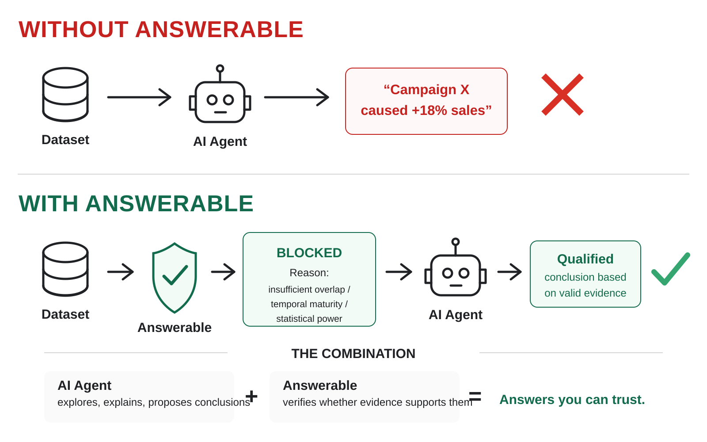

<div align="center">

# Answerable

### Evidence before answers.

**A deterministic validity layer for analytics and AI agents.**

Your code has tests. Your data has tests. **Your conclusions should too.**

[](https://pypi.org/project/answerable-data/)
[](https://github.com/Jairogelpi/answerable_data/actions/workflows/ci.yml)
[](https://github.com/Jairogelpi/answerable_data/actions/workflows/codeql.yml)


[Quickstart](#quickstart) · [Why Answerable](#why-answerable) · [Evidence](#evidence-not-promises) · [MCP](#use-answerable-as-an-mcp-tool) · [Benchmark](#epistemic-mutation-testing) · [Research](#research-and-reproducibility) · [Architecture](#architecture)

</div>

> [!IMPORTANT]
> **A correct number does not imply a justified conclusion.** Answerable checks whether the available evidence supports the claim an analyst or agent is about to make — and fails closed when it does not.


### AI agent + Answerable

The agent explores and explains; Answerable deterministically checks whether the evidence supports the conclusion before it reaches a user.



## The problem

Analytics systems are good at computing answers. LLMs are good at explaining them. Neither fact guarantees that the evidence justifies the conclusion.

A dataset can show a real difference while still failing the assumptions required to say that one thing caused another. A predictive result can look strong while leaking future information. A metric can be numerically correct while its definition changed halfway through the period. A cohort can look worse simply because recent entities have not had enough time to mature.

**Answerable sits between evidence and conclusion.** It turns those validity conditions into executable checks and produces a deterministic verdict plus an Evidence Warrant describing what may and may not be claimed.

```text
Data + analytical question
          │
          ▼
┌─────────────────────────┐
│        Answerable       │
│ deterministic validity  │
└─────────────────────────┘
          │
          ├── data/grain validity
          ├── temporal validity
          ├── statistical validity
          ├── causal identification
          ├── predictive leakage
          ├── metric semantics
          └── evidence completeness
          │
          ▼
Verdict + blockers + allowed claims + forbidden claims
          │
          ▼
      Evidence Warrant
```

## Quickstart

### 1. Install the production package

For CLI + MCP integration:

```bash
python -m pip install "answerable-data[mcp]"
answerable doctor
```

For CLI only:

```bash
python -m pip install answerable-data
```

Tagged releases are published through PyPI Trusted Publishing and the built distributions receive GitHub build-provenance attestations.

### 2. See the failure mode in one command

```bash
answerable demo
```

```text
Question: Did campaign exposure increase 90-day retention?

Observed data:
  exposed users have higher retention

Answerable:
  FUNDAMENTALLY_UNIDENTIFIABLE

Why:
  positivity_violation
  causal_identification_failure

Allowed:
  "Exposed customers had higher observed 90-day retention."

Forbidden:
  "The campaign caused higher 90-day retention."
```

That distinction is the product: **the arithmetic can be correct while the claim is wrong.**

### 3. Run it on your own data

```bash
answerable init --data customers.csv --output question.yaml
```

Review the explicit `TODO`s in the generated question contract, then:

```bash
answerable assess \
  --data customers.csv \
  --question question.yaml \
  --output runs/first
```

The run writes the question contract, data inventory, check plan, findings, evidence graph, verdict, repair plan and signed Evidence Warrant.

## Why Answerable

Most analytical tooling stops at one of three boundaries: whether the data is structurally valid, whether the code executed, or whether a model thinks the result sounds plausible. Answerable targets a different question:

> **Does this evidence justify this conclusion?**

| Capability | Data tests | Statistical code | LLM-as-judge | Answerable |
| --- | ---: | ---: | ---: | ---: |
| Check schema/nulls/duplicates | Yes | Sometimes | Sometimes | **Yes** |
| Check grain and joins | Sometimes | Manual | Sometimes | **Yes** |
| Check temporal maturity | Rarely | Manual | Sometimes | **Yes** |
| Check causal identification | No | Manual | Nondeterministic | **Yes** |
| Check prediction-time leakage | Rarely | Manual | Nondeterministic | **Yes** |
| Decide whether a claim must be retracted | No | No | Nondeterministic | **Yes** |
| Produce machine-readable blockers | Sometimes | Custom | Variable | **Yes** |
| Produce allowed/forbidden claims | No | No | Variable | **Yes** |
| Produce a verifiable evidence artifact | No | No | No | **Evidence Warrant** |
| Deterministic release gate | Yes | Possible | No | **Yes** |

Answerable is not trying to replace data-quality frameworks, statistical libraries or LLMs. It is the **claim-validity layer between them and the statement that reaches a human or downstream agent**.

## Who it is for

Answerable is designed for:

- AI agents that analyze data and write conclusions;
- analytics and BI pipelines that publish executive claims automatically;
- data scientists who need explicit validity gates before interpretation;
- experiment and causal-analysis workflows;
- ML systems that need leakage and evidence checks before reporting performance;
- teams that need a reproducible audit trail for why a conclusion was allowed or blocked.

It is deliberately **not** a chat-with-data product, dashboarding system, generic dataframe library, causal estimator, or replacement for domain expertise.

## Evidence, not promises

Answerable is built around executable evidence rather than README-only claims.

### Real end-to-end engine

`answerable assess` executes the actual assessment path:

```text
question contract
      +
immutable data fingerprint
      ↓
deterministic check plan
      ↓
validity checks
      ↓
evidence graph
      ↓
verdict precedence
      ↓
repair plan
      ↓
Evidence Warrant
```

### Real MCP server

`answerable mcp` is a real FastMCP stdio server. Its tools call the same `AssessmentRunner`, file inspector and warrant verification code used elsewhere in the package. There is no second mock assessment engine for agents.

### Frozen benchmark

The `emt-v2` benchmark is hash-addressed and immutable once published. The current release gate runs 112 paired evidence mutations across seven independent failure classes.

### Real external-agent runs

The repository includes full prompts, raw responses, decisions and scoring artifacts from actual Claude and Codex CLI runs against the frozen benchmark case set.

### Verification gates

The engineering verification path includes branch-aware coverage of at least 95%, strict mypy, Ruff, schema validation, requirement traceability, clean package build/install, deterministic mutation testing and CodeQL.

## Answerable vs real LLM agents

On the frozen `emt-v2` case set, Answerable and external LLMs were asked to update a conclusion after the evidence changed. The repository contains the raw runs and scoring artifacts.


| | Answerable | Claude | Codex |
| --- | ---: | ---: | ---: |
| Overall oracle accuracy | **100%** | 79.0% | 60.7% |
| Unsafe `KEEP` | **0%** | 0% | 0% |

The interesting failure is not arithmetic. Both models handled familiar leakage failures well, but frequently softened several statistical and causal invalidations into `QUALIFY` instead of retracting the claim. The full methodology, raw responses, sample-size caveats and per-class results are preserved under [`benchmarks/epistemic_mutations/results/2026-08-17-emt-v2-claude-codex/`](benchmarks/epistemic_mutations/results/2026-08-17-emt-v2-claude-codex/).

This benchmark measures the models **without access to Answerable**. Giving the model Answerable as a callable tool is a separate intervention; the point of the MCP integration is to move the validity decision outside the model's own judgment.

## Use Answerable as an MCP tool

Install the package with the MCP extra:

```bash
python -m pip install "answerable-data[mcp]"
```

### Claude Code

```bash
claude mcp add answerable -- answerable mcp
```

### Codex

```bash
codex mcp add answerable -- answerable mcp
```

### Any stdio MCP host

```json
{
  "command": "answerable",
  "args": ["mcp"]
}
```

The server exposes eight typed tools:

| Tool | What it does |
| --- | --- |
| `frame_question` | Scaffolds a question contract from a dataset and leaves analytical uncertainty explicit. |
| `inspect_data` | Profiles columns without returning row-level data. |
| `assess_answerability` | Runs the real deterministic assessment engine. |
| `get_assessment` | Reloads verdict and warrant artifacts. |
| `explain_finding` | Explains one blocker/finding from a completed run. |
| `design_missing_evidence_plan` | Returns the evidence repair plan. |
| `generate_analysis_plan` | Returns the deterministic check plan. |
| `verify_warrant` | Detects post-issuance modification of a warrant. |

Recommended agent policy:

```text
Before making a causal, predictive, diagnostic or prescriptive claim:
  call assess_answerability
        ↓
  read verdict + blockers + allowed_claims + forbidden_claims
        ↓
  never emit a forbidden claim
        ↓
  if blocked, state the blocker and use only the supported narrower claim
```

See [`docs/MCP.md`](docs/MCP.md) for the complete integration and disclosure model.

## Golden cases

Three adversarial demos ship with the package:

| Demo | Broken assumption | Expected signal |
| --- | --- | --- |
| `answerable demo causal` | Treatment has zero covariate overlap | `positivity_violation` |
| `answerable demo grain` | One customer appears twice at a declared one-row-per-customer grain | `duplicate_entities` |
| `answerable demo maturity` | Recent cohorts have not completed the 90-day outcome window | `immature_cohort` |

The source datasets and question contracts live under [`examples/`](examples/). The verdicts are generated by the engine; they are not hard-coded demo strings.

## Bring your own data

Hand-writing a complete analytical contract is unnecessary for the first pass. `answerable init` inspects the file schema and proposes roles that can be inferred safely:

```bash
answerable init --data customers.csv --output question.yaml
```

```text
Scaffolded question.yaml from customers.csv
  + entity_column: customer_id
  + event_time_column: acquisition_date
  + treatment_column: campaign_exposed
  + outcome_column: retained_90d
  + covariate_columns: acquisition_channel

Edit the TODO fields, then:
answerable assess --data customers.csv --question question.yaml --output runs/first
```

A unique identifier, date/time column, low-cardinality treatment candidate and numeric/boolean outcome can be proposed from the schema. Decisions the file cannot justify — the analytical question, claim semantics and causal design — remain explicit `TODO`s rather than being silently invented.

## Evidence Warrants

Every completed assessment emits a human-readable `warrant.md` plus a canonical machine-readable `warrant.json`.

A warrant records:

- the verdict;
- claims the evidence supports;
- claims the evidence does not support;
- decisive blockers/findings;
- assumptions;
- repair actions;
- provenance required to reproduce the assessment.

Verify one:

```bash
answerable --json warrant verify --warrant runs/first/warrant.json
```

Modification after issuance causes verification to fail.

The full artifact set includes:

```text
question_contract.json
data_inventory.json
check_plan.json
findings.json
evidence_graph.json
verdict.json
repair_plan.json
warrant.json
warrant.md
```

## Verdicts

| Verdict | Meaning |
| --- | --- |
| `ANSWERABLE` | Evidence supports the specified claim. |
| `ANSWERABLE_WITH_ASSUMPTIONS` | Support depends on explicit assumptions. |
| `PARTIALLY_ANSWERABLE` | A narrower claim is supportable. |
| `NOT_ANSWERABLE_YET` | Repairable evidence is missing. |
| `FUNDAMENTALLY_UNIDENTIFIABLE` | The requested effect cannot be identified by the available design. |
| `INSUFFICIENT_POWER` | The design cannot detect the relevant effect reliably. |
| `DATA_INTEGRITY_FAILURE` | Data defects invalidate the result. |
| `ASSESSMENT_INCOMPLETE` | Mandatory execution evidence is absent. |

## What Answerable tests

Current validity coverage includes:

- causal attribution without an identifiable comparison;
- positivity/overlap failures;
- incomplete outcome windows and right censoring;
- duplicated or ambiguous units of analysis;
- unsafe joins and incompatible grain;
- target and temporal leakage;
- underpowered or invalid experiments;
- metric-definition changes;
- informative missingness;
- unsupported causal, predictive, diagnostic and prescriptive language;
- failure to retract, qualify or reverse a conclusion after evidence-changing mutations.

The core rule is:

> **The model may interpret. Tools measure. Rules verify. Evidence decides.**

## Epistemic Mutation Testing

Ordinary benchmarks ask whether a system got an answer right once. Answerable also tests whether it **updates the conclusion correctly when the evidence changes**.


```bash
answerable benchmark mutations --output runs/epistemic-mutations
```

The current frozen benchmark executes **28 scenarios × 4 evidence mutations = 112 paired tests** through the real `AssessmentRunner`.

| Mutation family | Evidence change | Correct action |
| --- | --- | --- |
| `irrelevant_noise` | Only analytically irrelevant evidence changes | `KEEP` |
| `effect_attenuation` | Effect direction remains but materially weakens | `QUALIFY` |
| `evidence_invalidation` | A required validity condition is destroyed | `RETRACT` |
| `outcome_reversal` | Observed direction flips | `REVERSE` |

The 28 scenarios span seven failure classes:

| Class | What breaks | Representative blocker |
| --- | --- | --- |
| `causal` | Covariate overlap between arms | `positivity_violation` |
| `temporal` | Completed observation window | `immature_cohort` |
| `data_model` | Declared unit of analysis | `duplicate_entities` |
| `predictive` | Feature availability at prediction time | `prediction_leakage` |
| `statistical` | Sufficient power | `insufficient_power` |
| `metric_semantics` | Stable metric definition | `definition_change` |
| `missingness` | Outcome missingness assumptions | `informative_missingness` |

A deterministic benchmark release passes only when all 112 transitions are correct, unsafe `KEEP` is zero, every mutation family and failure class scores 100%, and the semantic report reproduces independently of output directory.

Freeze a release:

```bash
answerable benchmark --freeze --output runs/frozen
```

Frozen releases contain `manifest.json`, `cases.jsonl`, `oracle.json`, `protocol.md` and `SHA256SUMS`. `emt-v1` remains preserved alongside `emt-v2`; published benchmark history is not rewritten when the benchmark expands.

## Command reference

Global `--json` can be placed before a subcommand for machine-readable output, for example `answerable --json doctor`.

| Command | What it does |
| --- | --- |
| `answerable doctor` | Checks runtime and core dependencies. |
| `answerable init --data <file> --output <question.yaml>` | Scaffolds a question contract from a data file. |
| `answerable demo [causal\|grain\|maturity]` | Runs a built-in adversarial case end to end. |
| `answerable assess --data <file>... --question <question.yaml> --output <dir>` | Executes the full assessment and writes an Evidence Warrant. |
| `answerable warrant verify --warrant <warrant.json>` | Verifies warrant integrity. |
| `answerable warrant show \| export` | Inspects or exports a warrant. |
| `answerable benchmark mutations --output <dir>` | Runs the live 112-pair mutation benchmark. |
| `answerable benchmark --freeze --output <dir>` | Produces a hash-addressed frozen benchmark release. |
| `answerable source add \| test` | Registers and health-checks supported read-only data connectors. |
| `answerable mcp` | Starts the packaged FastMCP stdio server. |

External-agent benchmark utilities live under `scripts/` and preserve blind case export, raw agent runs, decision scoring, statistical comparison and SVG regeneration.

## Engineering evidence

The engine currently includes:

- content-hashed CSV, TSV, JSONL and Parquet intake;
- grain, join-cardinality and metric-semantic checks;
- temporal, missingness, experiment and statistical validity checks;
- causal, predictive, diagnostic and prescriptive contracts;
- guarded DuckDB and restricted Python execution;
- typed evidence graphs and deterministic verdict precedence;
- immutable, verifiable Evidence Warrants;
- paired epistemic mutation testing and external-agent scoring;
- SQLite, DuckDB and PostgreSQL-compatible read-only connectors;
- audit, retention and multi-tenant governance primitives;
- a packaged FastMCP server over stdio;
- API and HTML contract surfaces for future hosted integration.

The project is specification-driven and fail-closed. `docs/PRODUCT_SPEC.md` is normative and `requirements/traceability.yaml` maps verified requirements to implementation and tests.

## Architecture

```text
src/answerable/
├── application/          end-to-end assessment orchestration
├── framing/              question contracts and scaffolding
├── ingestion/            immutable file intake
├── analysis/             grain, joins and metric semantics
├── quality/              data, missingness and temporal validity
├── statistics/           experiments, power and inference
├── causal/               identification contracts
├── decision/             predictive/diagnostic/prescriptive rules
├── execution/            guarded DuckDB and Python
├── evidence/             graph, claims and deterministic verdicts
├── warrants/             canonical signed artifacts
├── enterprise/           connectors and governance
├── mutation_benchmark.py paired epistemic transition benchmark
└── interfaces/           FastMCP server + API contracts
```

For an agent, the important architecture is simpler:

```text
LLM / analyst
     │
     ▼
CLI or MCP adapter
     │
     ▼
ONE deterministic assessment engine
     │
     ▼
Evidence graph → verdict → warrant
```

There is one validity engine, not a different implementation per interface.

## Research and reproducibility

Answerable ships the material needed to inspect or challenge its claims:

- [`docs/paper/paper.md`](docs/paper/paper.md) — methodology, framing and threats to validity;
- [`benchmarks/epistemic_mutations/`](benchmarks/epistemic_mutations/) — benchmark protocol and external-agent evaluation workflow;
- [`benchmarks/releases/emt-v2/`](benchmarks/releases/emt-v2/) — frozen hash-addressed case set and oracle;
- [`benchmarks/epistemic_mutations/results/2026-08-17-emt-v2-claude-codex/`](benchmarks/epistemic_mutations/results/2026-08-17-emt-v2-claude-codex/) — raw external-model evidence and scoring;
- [`CITATION.cff`](CITATION.cff) — citation metadata;
- [`docs/THREAT_MODEL.md`](docs/THREAT_MODEL.md) — security threat model;
- [`requirements/traceability.yaml`](requirements/traceability.yaml) — requirement-to-test traceability.

The goal is not to ask users to trust a benchmark screenshot. It is to make the benchmark, oracle, raw outputs and scoring path inspectable.

## Development

```bash
python -m pip install -e ".[dev]"
make verify
make build
```

A contribution is not complete until formatting, linting, strict typing, tests, branch coverage, schemas, traceability and deterministic benchmark gates pass. See [`CONTRIBUTING.md`](CONTRIBUTING.md).

## Project status

| Surface | Status |
| --- | --- |
| Python package | ✅ published release pipeline |
| CLI | ✅ executable |
| Dataset → Evidence Warrant | ✅ executable |
| Golden adversarial demos | ✅ executable |
| Evidence Warrant verification | ✅ executable |
| EMT-v2 frozen benchmark | ✅ published |
| Claude/Codex external benchmark evidence | ✅ published |
| MCP stdio server | ✅ executable package extra |
| Read-only connectors | ✅ implemented |
| HTTP/web hosted product | 🚧 contract / pre-1.0 boundary |

Answerable is still pre-1.0 software. The assessment core, CLI, package, benchmarks, warrants and MCP server are executable; the web/HTTP surface is not presented as a finished hosted product. Do not use production-sensitive datasets without an independent security and methodological review.

See [`ROADMAP.md`](ROADMAP.md), [`SECURITY.md`](SECURITY.md), [`SUPPORT.md`](SUPPORT.md) and [`CHANGELOG.md`](CHANGELOG.md).

---

<div align="center">

### Data can produce an answer. Answerable asks whether it can support the conclusion.

**Install:** `pip install "answerable-data[mcp]"`

</div>
