<div align="center">

# Answerable

### Evidence before answers.

**Deterministic validity testing for analytics and AI conclusions.**

Your code has tests. Your data has tests. **Your conclusions should too.**

[](https://github.com/Jairogelpi/answerable_data/actions/workflows/ci.yml)
[](https://github.com/Jairogelpi/answerable_data/actions/workflows/codeql.yml)


[60-second demo](#60-second-demo) · [Install](#install) · [Bring your own data](#bring-your-own-data) · [Mutation benchmark](#epistemic-mutation-testing) · [Claude/Codex](#using-answerable-with-claude-code-and-codex) · [Command reference](#command-reference) · [Architecture](#architecture)

</div>

> [!IMPORTANT]
> **Correct arithmetic does not guarantee a justified conclusion.** Answerable checks whether the available evidence supports the claim before allowing the claim to pass.



## 60-second demo

Install the package, then run one command:

```bash
answerable demo
```

The default case contains a real observed retention difference, but exposed and unexposed customers have no comparable covariate overlap. A naive analysis can calculate the difference; Answerable refuses the causal attribution.

```text
Answerable demo
Case: Causal attribution trap
Question: Did campaign exposure increase 90-day retention?
Trap: The observed difference is real, but treatment has zero covariate overlap.

Verdict: FUNDAMENTALLY_UNIDENTIFIABLE
Blockers:
  x positivity_violation: No covariate stratum contains both exposed and unexposed entities.
  x causal_identification_failure: The requested causal estimand is not identified by the available design.
  x insufficient_power: Observed design power is below the configured target.

Supported claims:
  + Exposed customers had higher observed 90-day retention than unexposed customers.

Unsupported claims:
  - The campaign caused higher 90-day retention.
```

That distinction is the product: **a number can be correct while the conclusion is wrong.** It is not a hypothetical worry about LLMs — [tested against real Claude and Codex CLI calls](#answerable-vs-real-llm-agents) on the same kind of case, both models compute the right number and then keep the causal claim anyway when the comparison stops being valid.

## Install

### PyPI

Distributions are published through PyPI Trusted Publishing, with build provenance
attested on every tagged release:

```bash
python -m pip install answerable-data
answerable doctor
answerable demo
```

### From source

```bash
git clone https://github.com/Jairogelpi/answerable_data.git
cd answerable_data
python -m venv .venv
source .venv/bin/activate   # Windows: .venv\Scripts\activate
python -m pip install --upgrade pip
python -m pip install -e .
answerable doctor
answerable demo
```

`answerable doctor` verifies the runtime and core dependencies. A release is also tested by installing the built wheel into a clean virtual environment and running the product benchmarks from that wheel.

## Golden cases

Answerable ships three deliberately adversarial first-run cases:

| Demo | Broken assumption | Expected signal |
| --- | --- | --- |
| `answerable demo causal` | Treatment has zero covariate overlap | `positivity_violation` |
| `answerable demo grain` | One customer appears twice at a declared one-row-per-customer grain | `duplicate_entities` |
| `answerable demo maturity` | Recent cohorts have not completed the 90-day outcome window | `immature_cohort` |

The same cases are readable as normal repository fixtures under [`examples/`](examples/). They are not hand-authored verdicts: the engine executes checks against the data and question contract.

## Bring your own data

Hand-writing `question.yaml` from the schema reference is the biggest piece of friction between "I have a CSV" and a first real assessment. `answerable init` closes most of that gap by inspecting the file's own columns:

```bash
answerable init --data customers.csv --output question.yaml
```

```text
Scaffolded question.yaml from customers.csv
  + entity_column: customer_id
  + event_time_column: acquisition_date
  + treatment_column: campaign_exposed
  + outcome_column: retained_90d
  + covariate_columns: acquisition_channel
Edit the TODO fields, then: answerable assess --data ... --question question.yaml --output runs/first
```

The guesses come from the file's own schema (a unique ID column, a date/time-typed column, low-cardinality columns, a numeric or boolean outcome) — they are a starting point, not a verdict. Everything a guess can't resolve (the question being asked, which claims to check, the causal design) is left as an explicit `TODO` in the generated file, not silently assumed. Open it, fill in the `TODO`s, then run `answerable assess`.

## Epistemic Mutation Testing

Ordinary benchmarks ask whether a system got an answer right. Answerable also tests whether the system **updates the conclusion correctly when the evidence changes**.


*Regenerate after a run with `python scripts/render_benchmark_dashboard.py <report> --output benchmarks/epistemic_mutations/dashboard.svg`.*

```bash
answerable benchmark mutations --output runs/epistemic-mutations
```

The benchmark executes **28 scenarios × 4 evidence mutations = 112 paired tests** through the real `AssessmentRunner`.

| Mutation family | What changes | Oracle |
| --- | --- | --- |
| `irrelevant_noise` | Only an analytically irrelevant field changes | `KEEP` |
| `effect_attenuation` | The effect keeps its direction but materially weakens | `QUALIFY` |
| `evidence_invalidation` | A validity condition the design depends on is destroyed | `RETRACT` |
| `outcome_reversal` | The observed direction flips | `REVERSE` |

Scenarios span **seven failure classes**, each caught by a different, independently unit-tested detector — not one repeated pattern:

| Class | What breaks | Blocker |
| --- | --- | --- |
| `causal` | Covariate overlap between arms | `positivity_violation` |
| `temporal` | A completed observation window | `immature_cohort` |
| `data_model` | One row per unit of analysis | `duplicate_entities` |
| `predictive` | Features available before prediction time | `prediction_leakage` |
| `statistical` | A sample large enough to power the comparison | `insufficient_power` |
| `metric_semantics` | One stable metric definition across the period | `definition_change` |
| `missingness` | Outcome missingness independent of treatment | `informative_missingness` |

A release passes only when all 112 transitions are correct, the unsafe-`KEEP` rate is zero, every family *and every failure class* scores 100%, and the semantic report reproduces with the same hash independent of output directory.

The case list is frozen and hash-addressed as `emt-v2` (`answerable benchmark --freeze`), so published results refer to a benchmark that cannot be revised after the fact. The prior `emt-v1` release (48 pairs, 3 classes) stays published and immutable — see [Frozen release](benchmarks/epistemic_mutations/README.md#frozen-release) for how the two relate.

The report is written to `mutation_report.json` and includes the baseline/mutated verdicts, effect sizes, blockers, expected action and observed action for every pair.

For external model comparison, the evaluator requires a complete **3 agents × 2 repetitions × 112 pairs = 672 decisions** matrix and reports paired oracle accuracy, unsafe-`KEEP` rate and repeat consistency. Nondeterministic external model runs are deliberately kept outside the package release gate. The locked protocol is documented in [`benchmarks/epistemic_mutations/`](benchmarks/epistemic_mutations/).

### Answerable vs real LLM agents

Run through actual `claude` and `codex` CLI calls against the frozen `emt-v2` case set — not simulated, 448 real decisions across all 7 failure classes, full prompts and responses in [`benchmarks/epistemic_mutations/results/2026-08-17-emt-v2-claude-codex/`](benchmarks/epistemic_mutations/results/2026-08-17-emt-v2-claude-codex/):


| | Answerable | Claude | Codex |
| --- | --- | --- | --- |
| Overall accuracy | **100%** | 79.0% | 60.7% |
| Unsafe KEEP | 0% | 0% | 0% |

Both models are safe by the strictest measure (0% unsafe `KEEP` across all 112 pairs), but RETRACT accuracy on `evidence_invalidation` is not uniform across the 7 mechanisms — pooling into one number hides the actual finding:

| Failure class | Answerable | Claude | Codex |
| --- | --- | --- | --- |
| `predictive` (feature/prediction-time leakage) | 8/8 | **8/8** | **8/8** |
| `data_model` (grain duplication) | 8/8 | 1/8 | **8/8** |
| `causal`, `temporal`, `statistical`, `metric_semantics`, `missingness` | 8/8 each | 0–1/8 each | 0–1/8 each |

**Both models retract perfectly on data leakage — arguably the most heavily taught data-integrity failure in ML — and almost never on the five statistical/causal mechanisms**, which are comparatively under-taught and easier to soften into `QUALIFY` ("probably still there, just weaker") than to withdraw outright. A one-sided exact binomial test on the pooled wrong answers puts `QUALIFY`'s share at 47/47 for Claude (p = 3.76 × 10⁻²³) and 39/39 for Codex (p = 2.47 × 10⁻¹⁹) — not remotely explainable by chance. See the [full write-up](benchmarks/epistemic_mutations/results/2026-08-17-emt-v2-claude-codex/README.md) for sample-size caveats and how to reproduce it, and [`docs/paper/paper.md`](docs/paper/paper.md) for methodology and threats to validity. The earlier [3-class run](benchmarks/epistemic_mutations/results/2026-08-17-claude-codex/) stays published against `emt-v1`, unedited, per the freeze rule.

Note what this does *not* show: it measures the LLM's own judgment with no access to Answerable. Whether an agent given `assess_answerability` as a callable tool defers to it and gets these right is a different, separately-run [test below](#agent--tool-does-giving-claude-and-codex-the-tool-fix-it).

## Using Answerable with Claude Code and Codex

The result above is exactly the failure mode Answerable exists to catch. The direct fix is to put Answerable **between the agent and the claim it's about to make**: have the agent run the check as a tool call, and treat a blocked verdict as a hard stop, not a suggestion.

```text
Claude / Codex, mid-task
        ↓
about to claim:
"The campaign caused +12% retention"
        ↓
answerable assess --data ... --question ... --output runs/check
        ↓
exit code 2 (blocked) + positivity_violation
        ↓
agent must not make the causal claim;
it may say: "Observed retention was 12 points higher
(exit 0), but exposed and unexposed customers had
no comparable covariates — I can't attribute this to
the campaign."
```

There are two ways to connect this. Both call into the same real `AssessmentRunner` — neither is a mock.

### Option A — MCP server (native tool calls)

```bash
python -m pip install 'answerable-data[mcp]'
```

Add it as a tool server:

```bash
claude mcp add answerable -- answerable mcp   # Claude Code
codex mcp add answerable -- answerable mcp    # Codex
```

It exposes eight tools over stdio — `frame_question`, `inspect_data`, `assess_answerability`, `get_assessment`, `explain_finding`, `design_missing_evidence_plan`, `generate_analysis_plan`, `verify_warrant` — each backed by the same code path the CLI uses, never a fabricated result. `inspect_data` never returns row-level data, only column profiles.

### Option B — shell command (zero extra install)

Neither agent needs the MCP extra to do this today: both are CLIs that already run shell commands, and `answerable` is a CLI.

**Claude Code** — add to the project's `CLAUDE.md`:

```markdown
## Analytical claims

Before asserting that a change *caused* a metric to move (not just that it
*correlated with* one), run:

    answerable assess --data <csv> --question <question.yaml> --output runs/check

Exit code 0 means the causal claim is supported — check `runs/check/warrant.md`
for exactly what is and isn't supported. Exit code 2 means it's blocked: state
the blocker (e.g. `positivity_violation`, `insufficient_power`) and offer only
the descriptive claim, not the causal one. Use `answerable init --data <csv>
--output question.yaml` to scaffold the question file if one doesn't exist yet.
```

**Codex** — the equivalent goes in `AGENTS.md`, same content: Codex reads `AGENTS.md` for project-level instructions the same way Claude Code reads `CLAUDE.md`.

Either way, the agent is the one asking the question and reading the warrant — Answerable doesn't call the LLM, the LLM calls Answerable. That keeps the check deterministic and outside the model's own judgment, which is the entire point given the result two sections up.

## Assess your own data

```bash
answerable assess \
  --data customers.csv \
  --question question.yaml \
  --output runs/my_assessment
```

An assessment executes this chain:

```text
question contract
      +
immutable data fingerprint
      ↓
deterministic checks
      ↓
evidence graph
      ↓
verdict
      ↓
repair plan
      ↓
Evidence Warrant
```

The run emits machine-readable artifacts plus a human-readable warrant, including `question_contract.json`, `data_inventory.json`, `check_plan.json`, `findings.json`, `evidence_graph.json`, `verdict.json`, `repair_plan.json`, `warrant.json` and `warrant.md`.

Exit codes are intentional: `0` means the requested conclusion is cleanly answerable, `2` means the analytical request is blocked, and `3` means warrant verification failed.

## Evidence Warrants

A warrant records what the data supports, what it does not support, the decisive evidence, assumptions, repair actions and provenance needed to reproduce the assessment.

Verify one:

```bash
answerable --json warrant verify --warrant runs/my_assessment/warrant.json
```

If the warrant is modified after issuance, verification fails.

## Command reference

Every subcommand accepts a global `--json` flag before it for machine-readable output (`answerable --json doctor`).

| Command | What it does |
| --- | --- |
| `answerable doctor` | Checks the runtime and core dependencies are installed and importable. |
| `answerable init --data <file> --output <question.yaml>` | Scaffolds a question file from a data file's own columns. See [Bring your own data](#bring-your-own-data). |
| `answerable demo [causal\|grain\|maturity]` | Runs one of the three built-in adversarial cases end to end. |
| `answerable assess --data <file>... --question <question.yaml> --output <dir> [--format json\|markdown\|both]` | Runs a full assessment: ingestion → checks → evidence graph → verdict → Evidence Warrant. Exit `0` clean, `2` blocked. |
| `answerable warrant verify --warrant <warrant.json>` | Verifies a warrant's signature hasn't been tampered with. Exit `3` on failure. |
| `answerable warrant show \| export` | Inspect or export a warrant (see [Evidence Warrants](#evidence-warrants)). |
| `answerable benchmark mutations --output <dir>` | Runs the 112-pair Epistemic Mutation Testing release gate against the live engine. Exit `4` if it doesn't pass. |
| `answerable benchmark --freeze --output <dir>` | Writes the frozen, hash-addressed benchmark release (`manifest.json`, `cases.jsonl`, `oracle.json`, `protocol.md`, `SHA256SUMS`). |
| `answerable source add \| test` | Registers and health-checks a read-only data connector (SQLite/DuckDB/PostgreSQL-compatible). |
| `answerable mcp` | Runs the MCP server over stdio (needs `pip install 'answerable-data[mcp]'`). See [Using Answerable with Claude Code and Codex](#using-answerable-with-claude-code-and-codex). |

Scripts outside the `answerable` CLI, for the benchmark's external-agent protocol (see [Epistemic Mutation Testing](#epistemic-mutation-testing)):

| Script | What it does |
| --- | --- |
| `scripts/export_mutation_agent_cases.py` | Exports the blind evidence pairs (no oracle) for a hand-run external comparison. |
| `scripts/run_agent_harness.py` | Drives `claude`/`codex` CLIs and the Gemini API through the frozen cases automatically. |
| `scripts/score_mutation_agents.py` | Scores a completed 3-agent × 2-repetition decision file. |
| `scripts/build_emt_results.py` | Merges LLM decisions with Answerable's own (live, re-run) decisions and runs the significance test. |
| `scripts/render_benchmark_dashboard.py` / `render_agent_comparison.py` | Regenerate the SVG dashboards embedded in this README. |

## What Answerable is testing

Answerable is not a generic chat-with-data system and does not optimize for always returning an answer. It is a validity layer between evidence and conclusions.

Examples of failures it is designed to surface include:

- causal attribution without an identifiable comparison;
- incomplete outcome windows and right censoring;
- duplicated or ambiguous units of analysis;
- target or temporal leakage;
- unsafe joins and incompatible grain;
- underpowered or invalid experiments;
- unsupported causal, predictive, diagnostic or prescriptive language;
- failure to retract, qualify or reverse a claim after evidence-changing mutations.

The core rule is:

> **The model may interpret. Tools measure. Rules verify. Evidence decides.**

## Verdicts

| Verdict | Meaning |
| --- | --- |
| `ANSWERABLE` | Evidence supports the specified claim |
| `ANSWERABLE_WITH_ASSUMPTIONS` | Support depends on explicit assumptions |
| `PARTIALLY_ANSWERABLE` | A narrower claim is supportable |
| `NOT_ANSWERABLE_YET` | Repairable evidence is missing |
| `FUNDAMENTALLY_UNIDENTIFIABLE` | The requested effect cannot be identified |
| `INSUFFICIENT_POWER` | The design cannot detect a relevant effect |
| `DATA_INTEGRITY_FAILURE` | Data defects invalidate the result |
| `ASSESSMENT_INCOMPLETE` | Mandatory execution evidence is absent |

## Engineering evidence

The project is specification-driven and fail-closed. The verification suite enforces branch-aware coverage of at least 95%, strict mypy, Ruff, public-schema validation, requirement traceability, clean package build/install, the 112-pair Epistemic Mutation Testing release gate and CodeQL.

The current engine includes:

- content-hashed CSV, TSV, JSONL and Parquet intake;
- grain, join-cardinality and metric-semantic checks;
- temporal, missingness, experiment and statistical validity checks;
- causal, predictive, diagnostic and prescriptive contracts;
- guarded DuckDB and restricted Python execution;
- typed evidence graphs and deterministic verdict precedence;
- immutable, verifiable Evidence Warrants;
- paired epistemic mutation testing and external-agent scoring;
- SQLite, DuckDB and PostgreSQL-compatible read-only connectors;
- audit, retention and multi-tenant governance primitives;
- a real MCP server (`answerable mcp`, `pip install 'answerable-data[mcp]'`) alongside API and HTML contract surfaces.

## Architecture

```text
src/answerable/
├── application/          end-to-end assessment orchestration
├── framing/              question contracts
├── ingestion/            immutable file intake
├── analysis/             grain, joins and metrics
├── quality/              data and temporal validity
├── statistics/           experiments and inference
├── causal/               identification contracts
├── decision/             predictive/diagnostic/prescriptive rules
├── execution/            guarded DuckDB and Python
├── evidence/             graph, claims and verdicts
├── warrants/             canonical signed artifacts
├── mutation_benchmark.py paired epistemic transition benchmark
├── enterprise/           connectors and governance
└── interfaces/           real MCP server, API/HTML contracts
```

`docs/PRODUCT_SPEC.md` is normative. `requirements/traceability.yaml` maps verified requirements to implementation and tests.

## Development

```bash
python -m pip install -e ".[dev]"
make verify
make build
```

A contribution is not complete until formatting, linting, strict typing, tests, coverage, schemas, traceability and the deterministic benchmark gate pass. See [CONTRIBUTING.md](CONTRIBUTING.md).

## Current boundary

Answerable is still pre-1.0 software. The end-to-end assessment path, golden demos, mutation benchmark, validity core, warrants, verification path and MCP server are executable. The web/HTTP API surface remains a contract rather than a finished hosted product. Do not use production-sensitive datasets without an independent security and methodological review.

See [ROADMAP.md](ROADMAP.md), [SECURITY.md](SECURITY.md), [SUPPORT.md](SUPPORT.md) and [CITATION.cff](CITATION.cff).

---

<div align="center">

**Data can produce an answer. Answerable asks whether it can support the conclusion.**

</div>