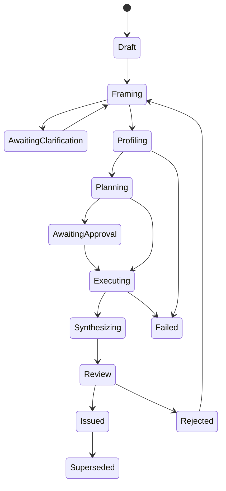

# Answerable — Complete Product Specification

**Document status:** Normative  
**Product scope:** Complete target product, not an MVP  
**Version:** 1.0.0-draft  
**Primary language:** English  
**Normative keywords:** MUST, MUST NOT, REQUIRED, SHOULD, SHOULD NOT, MAY

---

## 0. How to use this specification

This document is the implementation contract for Answerable. An implementation is conformant only when:

1. every applicable requirement has an automated test;
2. every test references at least one requirement ID;
3. all invariants in this document hold;
4. all public schemas pass contract tests;
5. all benchmark fixtures produce the expected verdict and claims;
6. no LLM output can bypass deterministic validation;
7. the complete verification suite passes from a clean checkout.

An implementation agent MUST work in the delivery order defined in Section 26. It MUST NOT implement a later phase by weakening, mocking away, or bypassing an earlier invariant.

### 0.1 Requirement types

| Prefix | Meaning |
| --- | --- |
| `INV-*` | Non-negotiable invariant |
| `FR-*` | Functional requirement |
| `NFR-*` | Non-functional requirement |
| `SEC-*` | Security and privacy requirement |
| `API-*` | Public API contract |
| `UX-*` | User-experience requirement |
| `TEST-*` | Testing requirement |
| `BENCH-*` | Benchmark requirement |
| `OPS-*` | Operations requirement |

### 0.2 Source-of-truth order

When artifacts conflict, use this precedence:

1. invariants in this document;
2. versioned JSON Schemas and OpenAPI;
3. executable acceptance tests;
4. this document's detailed requirements;
5. architecture decision records;
6. implementation comments;
7. generated prose.

No README example overrides this specification.

---

## 1. Product definition

Answerable is an analytical validity engine. It determines whether available evidence supports a requested conclusion and produces a reproducible Evidence Warrant.

### 1.1 Inputs

An assessment accepts:

- a natural-language question;
- one or more data sources;
- optional business context;
- optional metric definitions;
- optional semantic mappings;
- optional analytical assumptions;
- optional decision context;
- an execution policy;
- a privacy policy.

### 1.2 Outputs

An assessment produces:

- a normalized Question Contract;
- a Data Inventory;
- a Check Plan;
- immutable execution artifacts;
- an Evidence Graph;
- one primary verdict;
- allowed claims;
- forbidden claims;
- assumptions and sensitivity;
- blockers and warnings;
- a minimum-evidence repair plan;
- an optional permitted Analysis Plan;
- an Evidence Warrant;
- provenance sufficient to reproduce the assessment.

### 1.3 Product boundary

Answerable MUST determine what can be concluded before optionally performing a permitted analysis. It MUST NOT optimize for always returning an answer.

Answerable is not:

- a generic chat-with-data application;
- a universal dataset-quality scorer;
- a silent data-cleaning system;
- an AutoML system;
- a replacement for domain experts;
- a source of legal, clinical, or regulatory certification;
- a system that proves causality from observational data without explicit identification assumptions.

---

## 2. Core invariants

### `INV-001` Evidence before conclusion

Every material claim MUST reference one or more immutable evidence nodes. A claim with no evidence reference is invalid and MUST NOT appear in a final warrant.

### `INV-002` Deterministic blockers dominate

An LLM MUST NOT override a deterministic blocker. Human overrides MAY acknowledge an assumption but MUST NOT rewrite recorded evidence.

### `INV-003` No silent mutation

No source data may be changed silently. Transformations MUST be represented as versioned, replayable Transformation Artifacts with before/after statistics.

### `INV-004` Claim-type safety

Causal language MUST NOT be emitted unless the causal identification gate passes. Predictive performance MUST NOT be described as causal explanation.

### `INV-005` Power semantics

A non-significant result with insufficient power MUST NOT be described as evidence of no effect.

### `INV-006` Reproducibility

Identical normalized inputs, engine version, policy, seeds, and dependency lock MUST produce the same deterministic artifacts and verdict.

### `INV-007` Explicit uncertainty

Numerical estimates MUST include units, population, period, and uncertainty when uncertainty is statistically meaningful.

### `INV-008` Facts remain separate

Facts, inferences, assumptions, recommendations, and user decisions MUST be stored as distinct node types.

### `INV-009` Question-relative quality

Data defects MUST be evaluated against the specific Question Contract. Global profiling MAY be shown but MUST NOT determine the verdict by itself.

### `INV-010` Fail closed

Missing execution artifacts, executor failure, schema-validation failure, or incomplete mandatory checks MUST prevent an `ANSWERABLE` verdict.

### `INV-011` Immutable provenance

Completed executions and issued warrants MUST be append-only. Corrections create new versions linked to superseded versions.

### `INV-012` Minimal disclosure

Only the minimum data required by an executor or model may be disclosed. Raw rows MUST NOT be sent to an external model by default.

---

## 3. Personas and authorization

### 3.1 Roles

| Role | Capabilities |
| --- | --- |
| Viewer | Read assessments and warrants allowed by policy |
| Analyst | Create assessments, map fields, accept assumptions, execute checks |
| Reviewer | Approve or reject warrants and analytical assumptions |
| Data Steward | Manage connectors, semantic mappings, metric definitions, policies |
| Administrator | Manage workspace, identities, retention, encryption, integrations |
| Service Agent | Use API/MCP within explicitly granted scopes |

### 3.2 Authorization requirements

- `FR-AUTH-001`: Authorization MUST be workspace-scoped and resource-scoped.
- `FR-AUTH-002`: Every mutation MUST record actor, timestamp, request ID, and previous version.
- `FR-AUTH-003`: Service agents MUST receive least-privilege scopes.
- `FR-AUTH-004`: Data-source credentials MUST be separable from assessment access.
- `FR-AUTH-005`: Reviewer approval MUST be attributable to a human identity when policy requires human review.

---

## 4. End-to-end assessment lifecycle

### 4.1 State machine



### 4.2 State rules

- `FR-LIFE-001`: State transitions MUST be validated server-side.
- `FR-LIFE-002`: Invalid transitions MUST return a typed conflict error.
- `FR-LIFE-003`: Retrying an idempotent transition with the same idempotency key MUST return the original result.
- `FR-LIFE-004`: `Issued` warrants are immutable.
- `FR-LIFE-005`: A failed assessment MAY resume only from the last completed immutable checkpoint.
- `FR-LIFE-006`: Cancellation MUST stop future work but preserve completed artifacts.
- `FR-LIFE-007`: Every transition MUST produce an audit event.

---

## 5. Question framing

### 5.1 Question Contract

The Question Contract MUST contain:

```yaml
schema_version: "1.0"
question_id: "qst_..."
raw_question: "Did the campaign increase 90-day retention?"
normalized_question: "Estimate the causal effect of campaign exposure on 90-day retention."
language: "en"
analysis_type: "causal"
decision:
  owner: "Growth"
  action: "Continue, change, or stop the campaign"
  threshold: "absolute lift >= 0.03"
population:
  description: "Eligible customers acquired during Q2 2026"
  inclusion: []
  exclusion: []
unit_of_analysis: "customer"
outcome:
  metric_id: "retention_90d"
  definition: "active during days 76–90 after acquisition"
  value_type: "binary"
treatment:
  variable: "campaign_exposure"
  levels: ["exposed", "unexposed"]
comparison:
  type: "counterfactual"
time:
  observation_start: "2026-04-01"
  observation_end: "2026-09-30"
estimand:
  type: "ATE"
  scale: "risk_difference"
uncertainty:
  confidence_level: 0.95
  alpha: 0.05
  power: 0.80
  minimum_relevant_effect: 0.03
assumptions: []
open_questions: []
```

### 5.2 Framing requirements

- `FR-FRAME-001`: Classify questions as descriptive, comparative, diagnostic, predictive, causal, or prescriptive.
- `FR-FRAME-002`: Detect causal verbs and implicit causal intent.
- `FR-FRAME-003`: Identify metric, population, unit, comparison, period, and desired decision.
- `FR-FRAME-004`: A causal question MUST define treatment, outcome, estimand, and target population.
- `FR-FRAME-005`: A predictive question MUST define prediction time, target availability time, horizon, population, and action.
- `FR-FRAME-006`: A metric ratio MUST define numerator, denominator, aggregation, and eligibility.
- `FR-FRAME-007`: The system MUST request clarification only when alternatives materially alter required evidence or verdict.
- `FR-FRAME-008`: Every inferred field MUST retain source attribution and confidence.
- `FR-FRAME-009`: User-confirmed fields MUST supersede model inference without deleting inference history.
- `FR-FRAME-010`: Contradictory confirmed fields MUST block execution.

### 5.3 LLM framing contract

The model MUST return JSON conforming to the Question Contract proposal schema. Free text MUST NOT be parsed as an authoritative contract.

The framing prompt MUST:

1. include field definitions;
2. prohibit invented column names;
3. distinguish unknown from absent;
4. list ambiguities;
5. provide alternative interpretations;
6. attach confidence per inference;
7. avoid issuing a verdict.

Schema-invalid model output MUST be rejected and MAY be retried once with validation errors. A second failure MUST enter `AwaitingClarification` or `Failed`, never continue silently.

---

## 6. Data source and ingestion system

### 6.1 Supported complete-product sources

- CSV and TSV;
- Parquet;
- Arrow IPC;
- JSON Lines;
- Excel;
- DuckDB;
- PostgreSQL;
- MySQL;
- SQL Server;
- Snowflake;
- BigQuery;
- Databricks SQL;
- Redshift;
- local and S3-compatible object storage;
- read-only query-result uploads;
- dbt manifests and catalogs;
- semantic-layer metadata;
- optional BI metric metadata.

### 6.2 Connector contract

Every connector MUST implement:

```python
class DataConnector(Protocol):
    def test_connection(self) -> ConnectionTest: ...
    def discover(self, scope: DiscoveryScope) -> CatalogSnapshot: ...
    def get_schema(self, asset: AssetRef) -> AssetSchema: ...
    def estimate(self, query: QuerySpec) -> CostEstimate: ...
    def execute_readonly(self, query: QuerySpec) -> QueryArtifact: ...
    def fingerprint(self, asset: AssetRef) -> DataFingerprint: ...
    def close(self) -> None: ...
```

### 6.3 Ingestion requirements

- `FR-DATA-001`: Sources MUST be immutable from Answerable's perspective.
- `FR-DATA-002`: Database connectors MUST enforce read-only sessions where supported.
- `FR-DATA-003`: Files MUST be content-hashed.
- `FR-DATA-004`: Table snapshots MUST record schema, row-count estimate, freshness, and source fingerprint.
- `FR-DATA-005`: Sampling MUST be deterministic and recorded.
- `FR-DATA-006`: Sampling MUST preserve rare classes when stratification is requested.
- `FR-DATA-007`: Profiling MUST report whether statistics derive from full data or a sample.
- `FR-DATA-008`: Query cost limits MUST be enforced before execution.
- `FR-DATA-009`: Timeouts and partial reads MUST be represented as incomplete evidence.
- `FR-DATA-010`: Credentials MUST never enter warrants, prompts, logs, or execution artifacts.

---

## 7. Semantic and grain inference

### 7.1 Data Inventory

For each asset, record:

- physical type;
- semantic type;
- nullable state;
- units;
- timezone;
- cardinality;
- candidate keys;
- foreign-key candidates;
- time coverage;
- update cadence;
- likely entity;
- likely event;
- data owner if supplied;
- PII classification;
- quality observations.

### 7.2 Grain requirements

- `FR-GRAIN-001`: The system MUST infer and expose likely row grain.
- `FR-GRAIN-002`: Grain inference MUST distinguish entity duplicates from repeated events and line items.
- `FR-GRAIN-003`: Joins MUST be simulated or bounded before material execution.
- `FR-GRAIN-004`: Many-to-many joins MUST produce a blocker unless explicitly expected and normalized.
- `FR-GRAIN-005`: Pre/post-join row counts and metric totals MUST be reconciled.
- `FR-GRAIN-006`: Aggregation across incompatible grains MUST be blocked.
- `FR-GRAIN-007`: Ambiguous keys MUST request mapping or downgrade confidence.

---

## 8. Check Plan and skill system

### 8.1 Skill definition

A skill is a versioned planner that converts context into deterministic checks. A skill MUST NOT directly declare the final verdict.

```yaml
skill_id: "temporal_validity"
version: "1.2.0"
applies_to: ["descriptive", "comparative", "diagnostic", "predictive", "causal"]
inputs:
  - question_contract
  - data_inventory
outputs:
  - check_specs
  - evidence_requirements
  - clarification_requests
```

### 8.2 Required complete-product skills

1. question framing;
2. schema understanding;
3. grain and join validation;
4. metric design;
5. data integrity;
6. missing-data mechanisms;
7. sampling and selection;
8. temporal validity;
9. statistical uncertainty and power;
10. experiment validity;
11. causal identification;
12. predictive validity;
13. time-series validity;
14. diagnostic decomposition;
15. prescriptive/decision validity;
16. fairness and subgroup reliability;
17. privacy and disclosure;
18. robustness and sensitivity;
19. analysis planning;
20. evidence explanation.

### 8.3 Check specification

```yaml
check_id: "chk_..."
check_type: "cohort_maturity"
check_version: "1.0.0"
requirement_id: "FR-TIME-004"
rationale: "Retention outcomes require complete observation windows."
executor: "duckdb"
inputs:
  assets: ["customers"]
  fields: ["acquired_at", "last_active_at"]
parameters:
  horizon_days: 90
success_criteria:
  maximum_immature_fraction: 0.0
severity_on_failure: "blocker"
determinism:
  seed: null
privacy:
  row_access: false
```

### 8.4 Planner requirements

- `FR-PLAN-001`: Check selection MUST be a pure function of normalized assessment context and enabled policy.
- `FR-PLAN-002`: Mandatory checks MUST NOT be removed by the LLM.
- `FR-PLAN-003`: Model-proposed checks MUST map to a registered check type.
- `FR-PLAN-004`: Unknown check types MUST be rejected.
- `FR-PLAN-005`: Dependencies between checks MUST form a DAG.
- `FR-PLAN-006`: Cycles MUST fail validation before execution.
- `FR-PLAN-007`: Every check MUST define success, failure, inconclusive, and execution-error semantics.
- `FR-PLAN-008`: The plan MUST show estimated cost and required data disclosure.
- `FR-PLAN-009`: Policy-required approval MUST occur before sensitive or expensive checks.

---

## 9. Deterministic execution engine

### 9.1 Executors

- SQL executor;
- DuckDB executor;
- Python statistical executor;
- model-validation executor;
- causal-analysis executor;
- sandboxed transformation executor.

### 9.2 Execution Artifact

Every execution MUST record:

- artifact ID;
- check ID and version;
- engine and dependency versions;
- normalized code or query hash;
- input fingerprints;
- parameters;
- random seed;
- start/end timestamps;
- status;
- bounded logs;
- result payload;
- result schema;
- output hash;
- error classification;
- resource usage.

### 9.3 Execution requirements

- `FR-EXEC-001`: Executors MUST run with resource limits.
- `FR-EXEC-002`: Arbitrary model-generated code MUST NOT run outside the sandbox.
- `FR-EXEC-003`: SQL MUST be parsed and validated as read-only.
- `FR-EXEC-004`: Results MUST pass schema validation.
- `FR-EXEC-005`: Numerical NaN and infinity handling MUST be explicit.
- `FR-EXEC-006`: Randomized methods MUST use recorded seeds.
- `FR-EXEC-007`: Retryable and permanent errors MUST be distinguished.
- `FR-EXEC-008`: Retries MUST NOT create duplicate evidence.
- `FR-EXEC-009`: Partial completion MUST NOT be represented as success.
- `FR-EXEC-010`: Executor output MUST be content-addressed.

---

## 10. Analytical validity modules

### 10.1 Data integrity

Checks MUST cover:

- schema drift;
- type violations;
- impossible values;
- duplicate entity and event semantics;
- broken references;
- inconsistent units;
- freshness;
- truncation;
- source reconciliation;
- aggregation integrity.

### 10.2 Missing data

The system MUST:

- calculate missingness by field and relevant subgroup;
- evaluate relationship between missingness, treatment, outcome, and time;
- distinguish structural missingness from unavailable data;
- classify plausible MCAR/MAR/MNAR interpretations as hypotheses, not facts;
- run complete-case sensitivity where valid;
- compare supported imputation strategies;
- block claims when missingness destroys identification.

### 10.3 Temporal validity

Checks MUST cover:

- event ordering;
- prediction-time availability;
- cohort maturity;
- right/left censoring;
- seasonality;
- time-zone normalization;
- incomplete periods;
- structural breaks;
- delayed labels;
- look-ahead bias;
- backfilled fields;
- changing definitions.

### 10.4 Statistical validity

Checks MUST cover:

- sample size;
- uncertainty intervals;
- power and minimum detectable effect;
- test assumptions;
- multiple comparisons;
- robust alternatives;
- effect size versus significance;
- influential observations;
- subgroup instability;
- optional equivalence/non-inferiority tests.

### 10.5 Experiment validity

Checks MUST cover:

- randomization integrity;
- sample-ratio mismatch;
- exposure logging;
- contamination;
- novelty and carryover;
- attrition;
- pre-experiment balance;
- sequential testing;
- stopping rules;
- unit-of-randomization mismatch;
- clustered standard errors;
- guardrail metrics.

### 10.6 Causal validity

A causal assessment MUST construct:

- treatment;
- outcome;
- population;
- estimand;
- causal graph or explicit adjustment set;
- identification strategy;
- assumptions;
- falsification and sensitivity checks.

Supported strategies SHOULD include:

- randomized experiments;
- regression adjustment;
- matching/weighting;
- difference-in-differences;
- interrupted time series;
- regression discontinuity;
- instrumental variables;
- synthetic control;
- panel estimators.

The system MUST distinguish:

1. identification;
2. estimation;
3. refutation/sensitivity;
4. interpretation.

Failure of identification MUST block causal estimation even if an estimator can technically run.

### 10.7 Predictive validity

Checks MUST cover:

- prediction timestamp;
- train/validation/test separation;
- temporal split when required;
- target and feature leakage;
- baseline comparison;
- imbalance;
- calibration;
- discrimination;
- threshold utility;
- subgroup reliability;
- drift;
- label delay;
- external validity;
- uncertainty.

### 10.8 Diagnostic validity

Diagnostic analysis MUST:

- verify metric movement is real;
- reconcile source and definition changes;
- decompose by additive drivers where mathematically valid;
- separate contribution from causal explanation;
- detect Simpson's paradox;
- identify residual unexplained movement;
- label candidate drivers by evidence strength.

### 10.9 Prescriptive validity

Recommendations MUST include:

- decision objective;
- alternatives;
- constraints;
- expected utility;
- uncertainty;
- downside/guardrails;
- sensitivity to assumptions;
- conditions that would reverse the recommendation.

---

## 11. Evidence Graph

### 11.1 Node types

- Question;
- Decision;
- Population;
- Metric;
- Variable;
- Dataset;
- Requirement;
- Check;
- Execution;
- Observation;
- Fact;
- Assumption;
- Inference;
- Blocker;
- Warning;
- Allowed Claim;
- Forbidden Claim;
- Recommendation;
- Human Decision;
- Transformation;
- Warrant.

### 11.2 Edge types

- `requires`;
- `uses`;
- `computed_from`;
- `supports`;
- `contradicts`;
- `blocks`;
- `depends_on`;
- `assumes`;
- `qualifies`;
- `supersedes`;
- `approved_by`;
- `generated_by`.

### 11.3 Graph requirements

- `FR-GRAPH-001`: Nodes and edges MUST be typed and schema-validated.
- `FR-GRAPH-002`: Every claim MUST have a directed provenance path to source evidence.
- `FR-GRAPH-003`: Cycles in provenance paths MUST be rejected.
- `FR-GRAPH-004`: Contradictory evidence MUST remain visible.
- `FR-GRAPH-005`: Graph reduction for UI MUST NOT remove blocker paths.
- `FR-GRAPH-006`: Graph exports MUST be stable and versioned.
- `FR-GRAPH-007`: Clicking a UI node MUST expose its source and computation.

---

## 12. Verdict engine

### 12.1 Verdicts

Primary verdict enumeration:

- `ANSWERABLE`;
- `ANSWERABLE_WITH_ASSUMPTIONS`;
- `PARTIALLY_ANSWERABLE`;
- `NOT_ANSWERABLE_YET`;
- `FUNDAMENTALLY_UNIDENTIFIABLE`;
- `MISLEADING_QUESTION`;
- `INSUFFICIENT_POWER`;
- `DATA_INTEGRITY_FAILURE`;
- `ASSESSMENT_INCOMPLETE`.

### 12.2 Severity

Finding severity:

- `info`;
- `warning`;
- `limitation`;
- `blocker`;
- `fatal`.

### 12.3 Deterministic precedence

Apply the following order:

1. execution/schema/security fatal → `ASSESSMENT_INCOMPLETE`;
2. critical integrity blocker affecting all requested claims → `DATA_INTEGRITY_FAILURE`;
3. malformed or decision-misaligned question → `MISLEADING_QUESTION`;
4. impossible identification from existing design → `FUNDAMENTALLY_UNIDENTIFIABLE`;
5. recoverable missing evidence → `NOT_ANSWERABLE_YET`;
6. adequate design but inadequate power → `INSUFFICIENT_POWER`;
7. narrower supported claim exists → `PARTIALLY_ANSWERABLE`;
8. only assumption-dependent claim exists → `ANSWERABLE_WITH_ASSUMPTIONS`;
9. all mandatory requirements pass → `ANSWERABLE`.

Policy MAY choose a more conservative verdict but MUST NOT choose a less conservative verdict than deterministic precedence.

### 12.4 Verdict requirements

- `FR-VERDICT-001`: Each verdict MUST list decisive findings.
- `FR-VERDICT-002`: Each blocker MUST map to repairability: recoverable, design-impossible, or policy-forbidden.
- `FR-VERDICT-003`: Allowed and forbidden claims MUST be generated separately.
- `FR-VERDICT-004`: Generated claim wording MUST pass a claim-policy linter.
- `FR-VERDICT-005`: Causal terms MUST be forbidden when the causal gate fails.
- `FR-VERDICT-006`: The verdict MUST be reproducible without an LLM once the graph exists.

---

## 13. Claim language policy

### 13.1 Claim classes

- descriptive observation;
- association;
- predictive statement;
- causal effect;
- diagnostic hypothesis;
- recommendation.

### 13.2 Required phrasing controls

The claim linter MUST detect:

- causal verbs in non-causal claims;
- certainty exceeding evidence;
- omitted population or period;
- percentage versus percentage-point confusion;
- relative change without baseline;
- “no effect” from non-significance;
- extrapolation outside observed support;
- subgroup claims below reliability threshold;
- recommendations not linked to a decision.

### 13.3 LLM explanation

The LLM MAY improve readability only after receiving:

- fixed verdict;
- fixed allowed claim semantics;
- fixed forbidden concepts;
- evidence references;
- uncertainty constraints.

The rewritten output MUST be revalidated. If validation fails, use deterministic templates.

---

## 14. Minimum Evidence Plan

For every non-answerable or partial verdict, Answerable MUST produce:

- missing information;
- why it matters;
- whether it can be recovered retrospectively;
- collection method;
- required grain;
- required population;
- minimum time window;
- sample-size target where calculable;
- expected effect on verdict;
- cost/priority estimate;
- alternative question answerable now.

The plan MUST prefer the smallest sufficient repair, not request every theoretically useful field.

---

## 15. Permitted Analysis Plan

When at least one claim is permitted, Answerable MAY generate an Analysis Plan containing:

- question and estimand;
- validated datasets;
- transformations;
- metric computation;
- method;
- diagnostics;
- uncertainty;
- sensitivity checks;
- visualization specification;
- reporting language;
- acceptance criteria;
- executable notebook or pipeline reference.

Executing the Analysis Plan MUST create new evidence nodes. It MUST NOT mutate the assessment evidence retrospectively.

---

## 16. Evidence Warrant

### 16.1 Required sections

1. identity and version;
2. question;
3. decision context;
4. verdict;
5. executive explanation;
6. allowed claims;
7. forbidden claims;
8. decisive evidence;
9. assumptions;
10. limitations;
11. data-quality relevance;
12. minimum-evidence plan;
13. permitted analysis;
14. provenance;
15. reproducibility manifest;
16. approvals;
17. supersession status.

### 16.2 Format support

The canonical warrant MUST be JSON. YAML, Markdown, HTML, PDF, and notebook representations MUST be generated from canonical JSON.

### 16.3 Signing

Enterprise mode SHOULD support cryptographic signing. A signed warrant MUST include content hash, signer, timestamp, engine version, and signature verification status.

---

## 17. API specification

### 17.1 General rules

- Base path: `/v1`.
- JSON requests and responses.
- UTC ISO-8601 timestamps.
- UUIDv7 or equivalent sortable opaque identifiers.
- Cursor pagination.
- RFC 9457-style problem details.
- Idempotency keys on create/execute/issue operations.
- Optimistic concurrency through version or ETag.

### 17.2 Required endpoints

```text
POST   /v1/workspaces
GET    /v1/workspaces/{workspace_id}

POST   /v1/data-sources
POST   /v1/data-sources/{source_id}/test
GET    /v1/data-sources/{source_id}/catalog
DELETE /v1/data-sources/{source_id}

POST   /v1/assessments
GET    /v1/assessments/{assessment_id}
PATCH  /v1/assessments/{assessment_id}
POST   /v1/assessments/{assessment_id}/frame
POST   /v1/assessments/{assessment_id}/clarifications
POST   /v1/assessments/{assessment_id}/profile
POST   /v1/assessments/{assessment_id}/plan
POST   /v1/assessments/{assessment_id}/execute
POST   /v1/assessments/{assessment_id}/cancel
GET    /v1/assessments/{assessment_id}/events
GET    /v1/assessments/{assessment_id}/graph
GET    /v1/assessments/{assessment_id}/findings
POST   /v1/assessments/{assessment_id}/review
POST   /v1/assessments/{assessment_id}/issue

GET    /v1/warrants/{warrant_id}
GET    /v1/warrants/{warrant_id}/export
POST   /v1/warrants/{warrant_id}/supersede
POST   /v1/warrants/{warrant_id}/verify

GET    /v1/skills
GET    /v1/checks
GET    /v1/policies
POST   /v1/policies
```

### 17.3 Error codes

At minimum:

- `invalid_contract`;
- `clarification_required`;
- `invalid_state_transition`;
- `concurrency_conflict`;
- `source_unavailable`;
- `query_not_readonly`;
- `cost_limit_exceeded`;
- `execution_timeout`;
- `artifact_schema_invalid`;
- `mandatory_check_incomplete`;
- `policy_denied`;
- `warrant_not_issuable`.

---

## 18. Python, CLI, MCP, and CI interfaces

### 18.1 Python package

Public package SHOULD expose:

```python
from answerable import (
    Assessment,
    AssessmentPolicy,
    QuestionContract,
    Verdict,
    assess,
    verify_warrant,
)
```

Models MUST be typed. Public functions MUST have stable exceptions and async equivalents where I/O occurs.

### 18.2 CLI

Required commands:

```text
answerable init
answerable source add
answerable source test
answerable assess
answerable frame
answerable plan
answerable execute
answerable inspect
answerable warrant show
answerable warrant export
answerable warrant verify
answerable benchmark run
answerable doctor
```

CLI MUST support JSON output, non-interactive mode, exit codes, config precedence, and redaction.

### 18.3 MCP server

Required tools:

- `frame_question`;
- `inspect_data`;
- `assess_answerability`;
- `get_assessment`;
- `explain_finding`;
- `design_missing_evidence_plan`;
- `generate_analysis_plan`;
- `verify_warrant`.

MCP tools MUST return structured content and MUST NOT expose raw rows unless explicitly scoped.

### 18.4 GitHub Action

The action MUST:

- validate committed warrants;
- rerun selected local benchmark cases;
- detect unsupported changed claims;
- produce a concise PR annotation;
- support configurable failure policy;
- never require write access to repository contents.

---

## 19. Web product

### 19.1 Core screens

1. workspace home;
2. source catalog;
3. new assessment;
4. question framing;
5. field and metric mapping;
6. profiling results;
7. check-plan approval;
8. live execution;
9. evidence graph;
10. claim inspector;
11. repair plan;
12. warrant review;
13. warrant history;
14. policies and skills;
15. benchmark laboratory.

### 19.2 UX requirements

- `UX-001`: A first-time user MUST understand the verdict within ten seconds of opening the result.
- `UX-002`: Allowed and forbidden claims MUST be visually distinct.
- `UX-003`: Every blocker MUST be expandable to method and evidence.
- `UX-004`: The UI MUST distinguish missing, failed, and not-applicable checks.
- `UX-005`: Sampling and incomplete execution MUST remain visible.
- `UX-006`: Assumptions requiring human acceptance MUST use explicit controls.
- `UX-007`: The evidence graph MUST provide a reduced view and a complete provenance view.
- `UX-008`: Color MUST NOT be the only status signal.
- `UX-009`: Keyboard navigation and screen-reader labels are REQUIRED.
- `UX-010`: Destructive or costly actions MUST show scope before confirmation.

---

## 20. Security, privacy, and governance

### 20.1 Security requirements

- `SEC-001`: Encrypt data in transit and at rest.
- `SEC-002`: Store credentials in a dedicated secret store.
- `SEC-003`: Sandbox Python execution without unrestricted network access.
- `SEC-004`: Parse SQL and reject mutations, multi-statements, unsafe functions, and unbounded queries by policy.
- `SEC-005`: Apply row, byte, time, CPU, and memory limits.
- `SEC-006`: Sanitize filenames and archive extraction.
- `SEC-007`: Treat dataset text as untrusted input and defend against prompt injection.
- `SEC-008`: Redact secrets and direct identifiers from logs.
- `SEC-009`: Audit all access to sources and warrants.
- `SEC-010`: Support data deletion and retention policies.
- `SEC-011`: Dependency and container scanning are REQUIRED in CI.
- `SEC-012`: Threat modeling is REQUIRED before external model or connector release.

### 20.2 LLM privacy modes

- `none`: no LLM use;
- `metadata_only`: schema and aggregate statistics only;
- `sample_redacted`: policy-approved redacted samples;
- `local_model`: local inference;
- `external_approved`: explicit external provider policy.

Default MUST be `metadata_only` or stricter.

### 20.3 Prompt-injection defense

Values from datasets, metadata, documentation, or comments MUST be delimited as untrusted data. They MUST NOT be allowed to alter system instructions, tool permissions, verdict policy, or disclosure policy.

---

## 21. Observability and operations

- structured logs with request, assessment, and execution IDs;
- metrics for latency, failure rate, queue depth, retries, resource use, and verdict distribution;
- traces across orchestration and execution;
- no raw sensitive values in telemetry;
- health, readiness, and dependency endpoints;
- migration safety checks;
- backup and restore tests;
- disaster-recovery documentation;
- per-tenant quotas and circuit breakers.

### Operational SLO targets

For hosted production after stabilization:

- API availability: 99.9%;
- metadata requests p95: under 500 ms excluding source latency;
- assessment scheduling p95: under 2 s;
- no acknowledged warrant loss;
- recovery point objective: 15 min;
- recovery time objective: 4 h.

---

## 22. Persistence model

Core entities:

- Workspace;
- User;
- RoleBinding;
- DataSource;
- DataAsset;
- DataSnapshot;
- MetricDefinition;
- Assessment;
- QuestionContract;
- Clarification;
- SkillRun;
- CheckPlan;
- CheckExecution;
- Artifact;
- EvidenceNode;
- EvidenceEdge;
- Finding;
- Claim;
- AnalysisPlan;
- Review;
- Warrant;
- Policy;
- AuditEvent.

All versioned entities MUST use immutable version rows or event sourcing. Database constraints MUST enforce uniqueness, foreign keys, version monotonicity, and issued-warrant immutability.

---

## 23. Versioning and compatibility

- Semantic versioning for public packages and schemas.
- Schema version embedded in every public artifact.
- Additive fields MAY be introduced in minor versions.
- Removed or redefined fields require a major version.
- Migrations MUST be reversible until production verification.
- Old warrants MUST remain verifiable after upgrades.
- Check and skill versions MUST be pinned in the reproducibility manifest.
- Model provider and model version MUST be recorded when used.

---

## 24. Testing strategy

### 24.1 TDD loop

For every requirement:

1. write a failing test referencing the requirement ID;
2. implement the smallest behavior that passes;
3. refactor without changing observable behavior;
4. run affected unit and contract tests;
5. run full suite before completion;
6. update traceability matrix.

### 24.2 Required test layers

#### Unit tests

Pure domain rules, schema validators, precedence, linters, statistical helpers, graph rules, and policy evaluation.

#### Property-based tests

Use generated inputs for:

- idempotency;
- order independence where required;
- verdict monotonicity;
- graph invariants;
- serialization round trips;
- aggregation conservation;
- percentage/percentage-point correctness.

#### Contract tests

Every connector, executor, skill, API endpoint, MCP tool, and export format.

#### Golden tests

Stable Question Contracts, Check Plans, Evidence Graphs, and Warrants. Golden updates MUST require explicit review.

#### Statistical simulation tests

Simulate known data-generating processes to verify:

- Type I error;
- power;
- confidence-interval coverage;
- leakage detection;
- causal estimator behavior;
- missing-data sensitivity;
- calibration.

Tests MUST use tolerances justified by Monte Carlo error, not exact floating-point equality.

#### Metamorphic tests

Examples:

- row-order changes do not change results;
- duplicating every row is detected and does not silently double additive metrics;
- adding an irrelevant column does not change verdict;
- moving a feature after prediction time triggers leakage;
- removing the control group cannot improve causal verdict;
- increasing valid sample size cannot reduce calculated power, holding all else fixed.

#### Integration tests

Real DuckDB/PostgreSQL execution, queues, object storage, API, and sandbox boundaries.

#### End-to-end tests

Browser and CLI scenarios from data ingestion through warrant verification.

#### Security tests

SQL mutation attempts, code escape, decompression bombs, path traversal, prompt injection, secret leakage, tenant isolation, and authorization.

#### Performance tests

Representative datasets at 10k, 1m, 100m, and connector-pushdown scale.

### 24.3 Coverage policy

Coverage is a guardrail, not proof. Minimum targets:

- domain and verdict engine: 100% branch coverage;
- security-critical code: 100% branch coverage;
- public schemas and API: 100% contract coverage;
- overall Python line coverage: 90%;
- frontend critical flows: complete E2E coverage.

Mutation testing MUST be used on verdict rules, claim linter, and security policy. Target mutation score: at least 90%.

### 24.4 Test naming

```text
test_INV_004_blocks_causal_language_without_identification
test_FR_GRAIN_004_many_to_many_join_creates_blocker
test_FR_LIFE_003_repeated_idempotency_key_returns_original_result
```

### 24.5 Required CI jobs

1. formatting and lint;
2. static typing;
3. unit tests;
4. property tests;
5. contract tests;
6. integration tests;
7. frontend tests;
8. security scans;
9. schema compatibility;
10. benchmark smoke suite;
11. mutation-test scheduled suite;
12. packaging and clean-install test.

No failing required job may be bypassed by modifying thresholds in the same feature change without explicit architectural approval.

---

## 25. AnswerableBench

### 25.1 Case format

```yaml
case_id: "causal_immature_cohort_001"
version: "1.0.0"
question: "Did the campaign improve 90-day retention?"
assets:
  - path: "customers.parquet"
expected:
  verdict: "PARTIALLY_ANSWERABLE"
  required_findings:
    - "immature_cohorts"
    - "no_comparable_control"
  allowed_claim_classes:
    - "descriptive_observation"
  forbidden_claim_classes:
    - "causal_effect"
  minimum_evidence_items:
    - "matured_90_day_cohorts"
```

### 25.2 Required benchmark families

- schema and grain;
- join explosion;
- duplicates;
- missingness;
- selection and survival;
- time and censoring;
- experiments;
- causal identification;
- prediction and leakage;
- metric definition;
- diagnostic decomposition;
- fairness/subgroups;
- prescriptive decisions;
- prompt injection;
- executor failure and partial evidence.

### 25.3 Benchmark metrics

- verdict accuracy;
- blocker recall;
- false-blocker rate;
- allowed-claim precision;
- forbidden-claim recall;
- repair-plan sufficiency;
- evidence-path completeness;
- calibration;
- reproducibility;
- cost and latency.

The release gate MUST include zero causal-safety violations in critical benchmark cases.

---

## 26. Implementation delivery order

Each phase requires all tests and Definition of Done before the next phase.

### Phase 1 — Repository and engineering foundation

Deliver:

- package layout;
- dependency lock;
- lint/type/test configuration;
- CI;
- contribution guide;
- ADR template;
- schema-generation pipeline.

Definition of Done:

- clean install succeeds;
- empty test suite infrastructure runs;
- build artifacts are reproducible;
- branch protection requirements documented.

### Phase 2 — Domain model and schemas

Deliver:

- IDs and value objects;
- Question Contract;
- Check Plan;
- Execution Artifact;
- graph schemas;
- verdict and warrant schemas;
- serialization and migrations.

Definition of Done:

- schema round-trip tests;
- compatibility tests;
- invalid states rejected;
- traceability matrix started.

### Phase 3 — Lifecycle and persistence

Deliver:

- state machine;
- repositories;
- audit events;
- idempotency;
- optimistic concurrency;
- immutable issued warrants.

Definition of Done:

- state/property tests;
- retry tests;
- concurrency tests;
- persistence integration tests.

### Phase 4 — File ingestion and DuckDB

Deliver:

- CSV/Parquet/JSONL;
- hashing;
- deterministic sampling;
- schema/profile inventory;
- read-only DuckDB execution.

Definition of Done:

- malformed/large/adversarial file tests;
- stable fingerprints;
- bounded resource use;
- no silent coercion.

### Phase 5 — Grain, joins, and metric semantics

Deliver:

- grain inference;
- candidate keys;
- relationship mapping;
- fan-out simulation;
- metric definitions and reconciliation.

Definition of Done:

- benchmark cases for duplicate inflation and many-to-many joins;
- aggregation conservation property tests;
- ambiguous grain produces clarification/blocker.

### Phase 6 — Skill registry and Check Plan

Deliver:

- skill protocol;
- registry;
- mandatory deterministic planners;
- DAG validation;
- cost/privacy preview.

Definition of Done:

- planner snapshot tests;
- unknown checks rejected;
- no cyclic plans;
- mandatory checks cannot be removed.

### Phase 7 — Execution engine

Deliver:

- SQL/Python executors;
- sandbox;
- artifacts;
- retries;
- cancellation;
- content-addressed results.

Definition of Done:

- security escape tests;
- idempotent retries;
- timeout/partial-result behavior;
- reproducibility tests.

### Phase 8 — Question framing and LLM boundary

Deliver:

- provider-neutral model adapter;
- structured framing;
- clarification flow;
- injection defenses;
- no-LLM mode.

Definition of Done:

- schema-invalid outputs fail closed;
- adversarial dataset text cannot alter policy;
- deterministic fallback works;
- no model can set verdict.

### Phase 9 — Data quality and temporal modules

Deliver all checks in Sections 10.1–10.3.

Definition of Done:

- missingness and cohort benchmark families pass;
- question-relative relevance tested;
- leakage and censoring critical cases pass.

### Phase 10 — Statistical and experiment modules

Deliver all checks in Sections 10.4–10.5.

Definition of Done:

- simulation coverage and error rates validated;
- underpowered null cannot emit no-effect claim;
- sample-ratio and sequential-testing cases pass.

### Phase 11 — Causal module

Deliver:

- causal contract;
- graph/adjustment representation;
- identification strategies;
- estimation adapters;
- refutation and sensitivity.

Definition of Done:

- identification is tested separately from estimation;
- impossible designs fail before estimator execution;
- causal language critical suite has zero violations.

### Phase 12 — Predictive, diagnostic, and prescriptive modules

Deliver remaining Section 10 modules.

Definition of Done:

- target/temporal leakage detected;
- calibration and baseline enforced;
- contribution is not called causality;
- recommendations show reversal conditions.

### Phase 13 — Evidence graph and verdict engine

Deliver:

- graph store;
- provenance validation;
- deterministic precedence;
- claim linter;
- repair-plan generator.

Definition of Done:

- every emitted claim has a source path;
- mutation score target met;
- contradictory evidence remains visible;
- verdict reproducible with LLM disabled.

### Phase 14 — Warrant and analysis plan

Deliver:

- canonical JSON warrant;
- exports;
- signing option;
- permitted Analysis Plan;
- supersession.

Definition of Done:

- all formats derive from identical canonical data;
- old warrant verification works;
- issued warrant cannot mutate.

### Phase 15 — API, Python, CLI, and MCP

Deliver interfaces from Sections 17–18.

Definition of Done:

- OpenAPI contract tests;
- Python typing and clean-install tests;
- CLI JSON/exit-code tests;
- MCP scope and disclosure tests.

### Phase 16 — Web application

Deliver screens and requirements from Section 19.

Definition of Done:

- core browser flows pass;
- accessibility audit passes;
- verdict understood without opening advanced panels;
- complete provenance remains inspectable.

### Phase 17 — Enterprise connectors and governance

Deliver database/warehouse connectors, RBAC, policies, retention, audit, and private deployment.

Definition of Done:

- connector conformance suite passes;
- tenant-isolation tests pass;
- secrets never appear in artifacts;
- backup restore verified.

### Phase 18 — Full benchmark and release hardening

Deliver:

- complete benchmark;
- performance testing;
- threat model;
- release automation;
- migration rehearsal;
- operational runbooks.

Definition of Done:

- all release gates pass;
- zero critical safety violations;
- reproducible deployment;
- rollback tested;
- documentation matches actual behavior.

---

## 27. Agent implementation protocol

An AI coding agent implementing Answerable MUST:

1. read this entire specification;
2. inspect existing code and tests;
3. identify the current delivery phase;
4. select one bounded requirement cluster;
5. write failing tests first;
6. show the failure is caused by missing behavior;
7. implement the smallest conforming change;
8. run focused tests;
9. run all affected contract/integration tests;
10. update requirement traceability;
11. run the full quality gate;
12. report changed behavior, proof, and unresolved risks.

The agent MUST NOT:

- claim completion based only on code inspection;
- weaken a test to make an implementation pass;
- mock the behavior under test at its own boundary;
- add a fallback that silently converts failure into success;
- generate a verdict directly from an LLM response;
- introduce unversioned public schema changes;
- mix unrelated phases in one change;
- fabricate benchmark results;
- mark a requirement complete without automated evidence.

---

## 28. Requirement traceability

The repository MUST contain a machine-readable matrix:

```yaml
requirements:
  INV-004:
    implementation:
      - "answerable/claims/policy.py"
    tests:
      - "tests/claims/test_causal_language.py"
    benchmark_cases:
      - "causal/no_control_001"
    status: "verified"
```

Allowed statuses:

- `unimplemented`;
- `tests_written`;
- `implemented`;
- `verified`;
- `blocked`;
- `not_applicable`.

Only `verified` requirements count as delivered.

---

## 29. Complete-product acceptance scenario

The complete system MUST pass this end-to-end scenario:

1. A user connects a read-only warehouse.
2. The user asks whether a campaign caused an increase in 90-day retention.
3. The system frames the causal Question Contract and asks only material clarifications.
4. The user confirms metric and population.
5. The system discovers the relevant assets and their grain.
6. It detects incomplete exposure logging, cohort immaturity, changing customer mix, and a concurrent pricing intervention.
7. It calculates descriptive retention with uncertainty.
8. It determines that causal identification fails.
9. It emits `PARTIALLY_ANSWERABLE`.
10. It permits a time-bounded descriptive claim.
11. It forbids causal attribution.
12. It provides the smallest evidence-collection plan.
13. It generates a permitted descriptive Analysis Plan.
14. Every claim has a provenance path.
15. A reviewer inspects and issues the warrant.
16. The warrant is exported and later verified.
17. A new corrected dataset creates a new assessment and superseding warrant without altering history.

Failure of any step is a product-level defect.

---

## 30. Final definition of product completion

Answerable is complete when:

- all phases in Section 26 satisfy their Definition of Done;
- every applicable requirement is `verified`;
- all public interfaces conform to versioned contracts;
- all benchmark families pass release thresholds;
- critical claim-safety violations are zero;
- deterministic verdicts reproduce across supported environments;
- old warrants remain verifiable;
- security and isolation tests pass;
- a clean deployment, migration, backup, restore, and rollback have been demonstrated;
- the complete-product acceptance scenario passes without manual database edits or hidden operator intervention.

No number of implemented features compensates for violating the core invariants.

> **Answerable succeeds when it prevents a persuasive but unsupported conclusion and can prove exactly why.**
