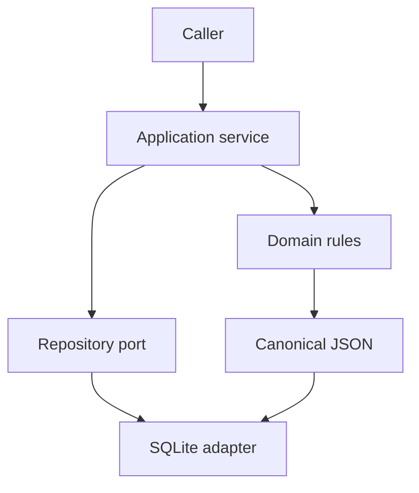

# Answerable SDD — Delivery Phases 1–3

## Status

This document records the executable software design for phases 1–3 of
`docs/PRODUCT_SPEC.md`. Later phases must consume these contracts rather than redefine them.

## Delivered scope

### Phase 1 — Engineering foundation

- `src` package layout with a dependency-free domain core.
- Reproducible `pyproject.toml`.
- Ruff, mypy, pytest, branch coverage, packaging, and traceability gates.
- Python 3.11/3.12 CI matrix.
- CodeQL, Dependabot, CODEOWNERS, issue forms, and pull-request template.
- ADR and contribution processes.

### Phase 2 — Domain model and schemas

- Frozen value models for Question Contract, Check Plan, Execution Artifact, Evidence Graph,
  Warrant, and Assessment.
- Stable enum contracts for analysis types, verdicts, and assessment states.
- Canonical JSON and SHA-256 fingerprints.
- Versioned JSON Schema 2020-12 contracts in `schemas/v1`.

### Phase 3 — Lifecycle and persistence

- Explicit assessment state machine.
- Immutable assessment versions.
- Append-only SQLite reference repository.
- Optimistic concurrency.
- Idempotency-key conflict detection.
- Attributable audit events.
- Service-level create and transition use cases.

## Component boundaries

The domain imports neither SQLite nor application services. Persistence reconstructs domain values
from canonical payloads. Future API, CLI, and worker adapters must call application services instead
of manipulating repository rows.

## Invariants

1. Domain values are frozen; changes create a version.
2. State transitions are explicit allow-list operations.
3. Issued and superseded assessments cannot be changed.
4. Persistence retains every accepted version.
5. A write must provide the current expected version.
6. Reusing an idempotency key with another request is a conflict.
7. Every application mutation creates an attributable audit event.
8. Canonical JSON is stable under dictionary insertion order.

## Persistence schema

`assessment_versions` is append-only and keyed by `(assessment_id, version)`.
`assessment_heads` points to the current version and enables compare-and-swap updates.
`audit_events` records actor and version movement.
`idempotency` maps a key and request fingerprint to the first response.

SQLite is the reference adapter. A future PostgreSQL implementation must pass the same repository
contract tests and preserve the same transaction semantics.

## Error model

| Error | Meaning |
| --- | --- |
| `InvalidStateTransition` | The domain disallows the requested lifecycle movement |
| `RecordNotFound` | The requested aggregate does not exist |
| `RecordAlreadyExists` | Creation conflicts with an existing identity |
| `ConcurrencyConflict` | Expected version or idempotency request does not match |
| `ImmutableRecordError` | An issued or superseded aggregate would be changed |

Errors are typed so future HTTP and CLI adapters can map them without parsing messages.

## TDD evidence

Tests were created before the package existed. The initial run failed at import for all five test
modules. Implementation then made the specified unit and repository-contract tests pass.

The suite covers:

- valid and invalid state transitions;
- failed-state checkpoint recovery;
- immutable versions;
- cancellation artifact preservation;
- canonical serialization and round trips;
- append-only history;
- optimistic concurrency;
- idempotent retries and key misuse;
- attributable, non-duplicated audit events;
- public schema identity and structure.

## Extension rules

- New domain fields require schema and round-trip tests.
- New states require a state-machine ADR and exhaustive transition tests.
- New repository adapters must reuse the repository contract suite.
- New public schema versions must not modify files under an existing `schemas/vN` directory.
- No analytical logic belongs in these foundational modules.

